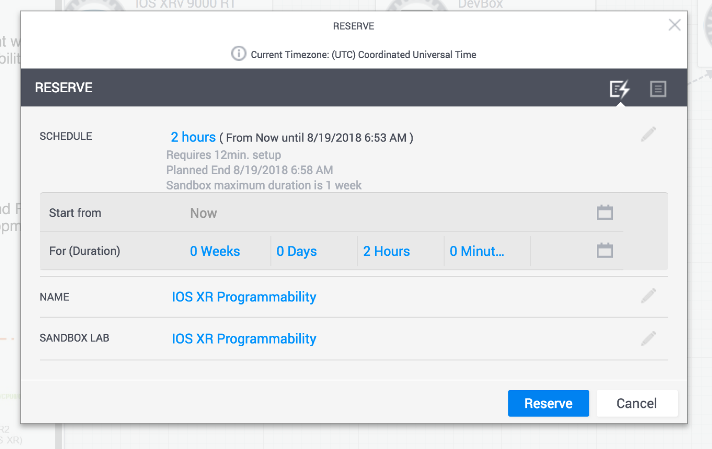

# Prelude
If you've been busy developing or utilizing external tools that help automate the IOS-XR CLI over Telnet/SSH using expect style send/receive transactions, then it is time to take a look at the new ZTP hooks embedded on the device. In this lab, we look at ZTP **Bash** hooks, enabling you to deterministically handle IOS-XR CLI automation across show commands, config-apply, config-replace and more, using on-box bash scripts or remote bash commands.

## Objectives

* Reserve and Familiarize yourself with the IOS-XR Devnet Sandbox
* Understand the ZTP infrastucture in IOS-XR
* Familiarize yourself with the ZTP bash helper library
* Write your first onbox IOS-XR CLI bash script
* Automate IOS-XR CLI using bash commands over SSH
* Extend remote bash execution capabilitiesto Config Management tools like Ansible, puppet etc.

## Prerequisites
Before we begin, take some time to reserve and familiarize yourself with the [IOS-XR programmability Sandbox on Devnet](https://devnetsandbox.cisco.com/RM/Diagram/Index/883f8ea6-54a1-453e-98f5-fc175a2a90de?diagramType=Topology).
Getting started is pretty straightforward - once you hit the above URL, click on the `Reserve` button on the top right:

and select the duration for which you'd like to reserve it (maximum duration = 1 week).

.

 asdasd

