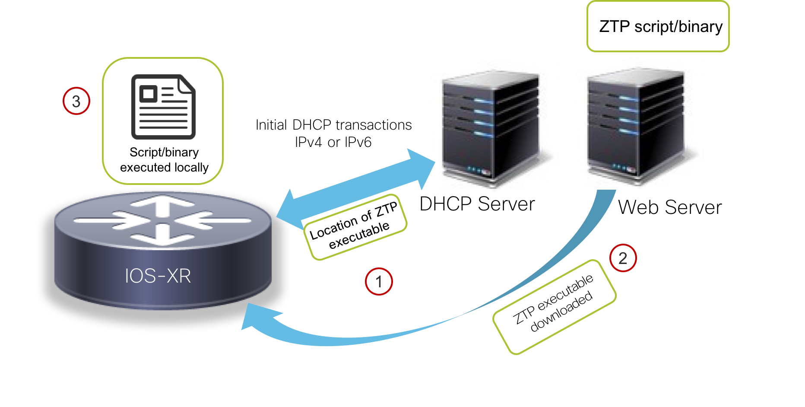

# Introduction: Understanding ZTP and the ZTP bash helper library

Zero Touch Provisioning(ZTP) is a device provisioning mechanism that allows network devices running IOS-XR to be powered-on and provisioned in a completely automated fashion. The high-level workflow for ZTP is as follows:

1. The network-device with an IOS-XR image installed is powered on.
2. Upon boot-up, the ZTP process runs if the device does not have a prior configuration.
3. The ZTP process triggers dhclient on the Management port (and with the upcoming IOS-XR 6.5.1 release, even on the production/data ports) to send out a DHCP request identifying itself using DHCP options:
    * DHCP(v4/v6) client-id=Serial Number,
    * DHCPv4 option 124: Vendor, Platform, Serial-Number
    * DHCPv6 option 16: Vendor, Platform, Serial-Number
4. The DHCP server identifies the device and responds with either an IOS-XR configuration file or a ZTP script as the filename option.
5. If the device receives a configuration file, it would simply apply the configuration and terminate the ZTP process.
6. If the device receives a script or binary executable, it will simply execute the script/binary in the default bash shell in a network namespace corresponding to the global/default VRF. This script can be used to configure the device and/or install IOS-XR packages, set up linux applications etc.

This workflow is depicted in the figure below:

  

>The concepts behind IOS-XR ZTP and further details on its operationalization in your network are expanded upon in the great set of blogs and tutorials on <https://xrdocs.io>.   
In particular:
>  * [**Working with IOS-XR ZTP**](https://xrdocs.io/software-management/tutorials/2016-08-26-working-with-ztp/)
>  * [**IOS-XR ZTP: Learning through Packet Captures**](https://xrdocs.io/software-management/blogs/2017-09-21-ios-xr-ztp-learning-through-packet-captures/)

## The ZTP Helper Libraries

It is clear from the above workflow that the DHCP server can respond to the device with a script/binary as one of the options.
This script/binary is executed in the IOS-XR Bash shell and may be used to interact with IOS-XR CLI to configure, verify the configured state and even run exec commands based on the workflow that the operator chooses.

So it goes without saying that the IOS-XR Bash shell must offer utilties/APIs/hooks that can allow a downloaded script/binary to interact-with/automate the IOS-XR CLI.

These utilities are provided by the `ZTP helper libraries for Bash and Python` that are available for scripts running on-box in the IOS-XR Linux shell.

### ZTP Helper bash Libary

The ZTP helper bash library is simply a bash script that creates useful wrappers out of pre-existing IOS-XR CLI interaction binaries in the IOS-XR shell.

On the router, this helper script is located at `/pkg/bin/ztp_helper.sh`.
To use this library, any Bash script (or even python scripts utilizing bash calls) must import the `ztp_helper.sh` library.  Upon import, the following bash hooks become available:

|Bash Utility|Argument|Function|
|:-------------:|:-------------|:------------|
|`xrcmd`|`<exec or show command>`| Exec commands and show commands in XR CLI|
|`xrapply`| `<local filename>`| **Configuration Merge.** Apply additional configuration using a file|
|`xrapply_with_reason`| **Arg1**: `<reason>`  **Arg2**: `<local filename>`  | **Configuration Merge**  Apply additional configuration using a file along with a **reason**     P.S. **reason** shows up as comment in `show configuration commit list detail`|
|`xrapply_string`|`<config string>`|**Configuration Merge.**  Apply additional configuration using a single line string (carriage returns are affected using `\n`)|
|`xrapply_string_with_reason`|**Arg1**: `<reason>` **Arg2**:`<config string>`|**Configuration Merge.** Apply additional configuration using a single line string (carriage returns are affected using `\n`)    P.S. **reason** shows up as comment in `show configuration commit list detail`|
|`xrreplace`|``<local filename>``|**Configuration Replace**. Replace existing configuration with the configuration contained in the filename specified as argument.|
|
