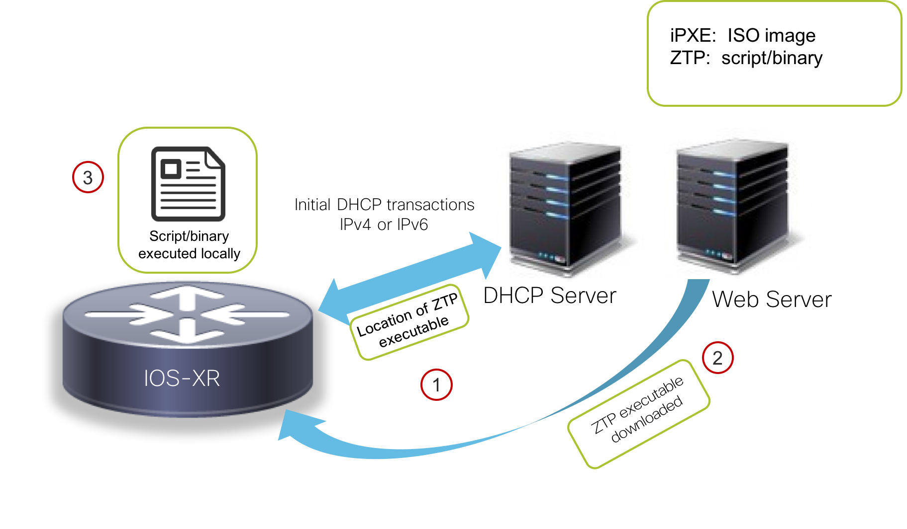

# Introduction: Understanding ZTP and the ZTP Python helper library

Zero Touch Provisioning(ZTP) is a device provisioning mechanism that allows network devices running IOS-XR to be powered-on and provisioned in a completely automated fashion. The high-level workflow for ZTP is as follows:

1. The network-device with an IOS-XR image installed is powered on.
2. Upon boot-up, the ZTP process runs if the device does not have a prior configuration.
3. The ZTP process triggers dhclient on the Management port (and with the upcoming IOS-XR 6.5.1 release, even on the production/data ports) to send out a DHCP request identifying itself using DHCP options:
    * DHCP(v4/v6) client-id=Serial Number,
    * DHCPv4 option 124: Vendor, Platform, Serial-Number
    * DHCPv6 option 16: Vendor, Platform, Serial-Number
4. The DHCP server identifies the device and responds with either an IOS-XR configuration file or a ZTP script as the filename option.
5. If the device receives a configuration file, it would simply apply the configuration and terminate the ZTP process.
6. If the device receives a script or binary executable, it will simply execute the script/binary in the default bash shell in a network namespace corresponding to the global/default VRF. This script can be used to configure the device and/or install IOS-XR packages, set up linux applications etc.

This workflow is depicted in the figure below:

  

>The concepts behind IOS-XR ZTP and further details on its operationalization in your network are expanded upon in the great set of blogs and tutorials on <https://xrdocs.io>.   
In particular:
>  * [**Working with IOS-XR ZTP**](https://xrdocs.io/software-management/tutorials/2016-08-26-working-with-ztp/)
>  * [**IOS-XR ZTP: Learning through Packet Captures**](https://xrdocs.io/software-management/blogs/2017-09-21-ios-xr-ztp-learning-through-packet-captures/)

<h3>Resetting router configurations</h3>
 Use this section to reset your router configurations to their base config when they're just launched using the devnet sandbox UI. **If you have just reserved the devnet sandbox and this is your first lab, you will NOT need to reset the router configurations and you can skip this Red box :)**. However, if you've been running multiple labs with the same reservation, you might want to clean the palate before proceeding to make sure all the following instructions match your experience with the sandbox environment.   To reset the configuration, first connect to the devbox: 
**Username**: admin **Password**: admin **SSH port**: 2211
<pre><code>Laptop-terminal:$ ssh -p 2211 admin@10.10.20.170
admin@10.10.20.170's password:
Last login: Sun Aug 26 17:34:49 2018 from 192.168.122.1
admin@devbox:~$
admin@devbox:~$
</code></pre>Clone the <https://github.com/CiscoDevNet/iosxr-programmability-devnet-labs-code> github repo and drop into the `reset_setup` directory:<pre><code>admin@devbox:~$
admin@devbox:~$ git clone https://github.com/CiscoDevNet/iosxr-programmability-devnet-labs-code
Cloning into 'iosxr-programmability-devnet-labs-code'...
remote: Counting objects: 38, done.
remote: Compressing objects: 100% (27/27), done.
remote: Total 38 (delta 5), reused 33 (delta 3), pack-reused 0
Unpacking objects: 100% (38/38), done.
Checking connectivity... done.
admin@devbox:~$
admin@devbox:~$
admin@devbox:~$ cd iosxr-programmability-devnet-labs-code/reset_setup/
admin@devbox:reset_setup$ ls
configs  connection_details.sh  reset_setup.sh
admin@devbox:reset_setup$
</code></pre>Now run `./reset_setup.sh` and your router configurations should get reset:<pre><code>admin@devbox:reset_setup$ ./reset_setup.sh

Starting Reset process for Router r1....
Connection to 10.10.20.170 closed.
Configuration done!
Verifying running configuration...
Connection to 10.10.20.170 closed.

Configuration Successful!

Starting Reset process for Router r2....
Connection to 10.10.20.170 closed.
Configuration done!
Verifying running configuration...
Connection to 10.10.20.170 closed.
Configuration Successful!

admin@devbox:reset_setup$
</code></pre>
And with that, you're all set to start this lab!

## The ZTP Helper Libraries

It is clear from the above workflow that the DHCP server can respond to the device with a script/binary as one of the options.
This script/binary is executed in the IOS-XR Bash shell and may be used to interact with IOS-XR CLI to configure, verify the configured state and even run exec commands based on the workflow that the operator chooses.

So it goes without saying that the IOS-XR Bash shell must offer utilties/APIs/hooks that can allow a downloaded script/binary to interact-with/automate the IOS-XR CLI.

These utilities are provided by the `ZTP helper libraries for Bash and Python` that are available for scripts running on-box in the IOS-XR Linux shell.

### ZTP Helper Python Libary

The ZTP helper Python library is simply a python script that creates useful wrappers out of pre-existing IOS-XR CLI interaction binaries in the IOS-XR shell.

On the router, this helper script is located at `/pkg/bin/ztp_helper.sh`.
To use this library, any Python script  must import the `ztp_helper.py` library.  Upon import, the following python hooks become available:

The ZTP python library defines a single Python class called `ZtpHelpers`. This class contains all the utility methods that are described below.

#### ZtpHelpers class Methods:   

<b>Object Creation:  `__init__()`</b>

**Purpose**: This method is invoked when the `ZtpHelpers` object is created.

All of the following parameters are optional. Python's default `syslog` capability is utilized for the setting below. When nothing is specified during object creation, then all logs are sent to a log rotated file `/tmp/ztp_python.log` (max size of 1MB)

<b><u>Input Parameters</u></b>

* `syslog_server`: IP address of reachable Syslog Server  
     *  <u>Parameter type</u>: `string`  

* `syslog_port`: Port for the reachable syslog server  
     *  <u>Parameter type</u>: `int`  

* `syslog_file`: Alternative or add-on file to store syslog
     *  <u>Parameter type</u>: `string`

<b>Debug Logging:  `toggle_debug()`</b>

**Purpose**: Used to Enable/disable verbose debug logging

<b><u>Input Parameters</u></b>

* `enable`: Enable/Disable flag
    * Parameter Type: `int`  

<b>Show/Exec CLI commands:    `xrcmd()`</b>

**Purpose**: Issue an IOS-XR show command or exec command and obtain the output.

<b><u>Input Parameters</u>

* `cmd`: Dictionary representing the XR exec cmd and response to potential prompts  
  <u>Parameter Type</u>: `dict`  
  These values are encoded in the dict as follows `{ 'exec_cmd': '', 'prompt_response': '' }`.   

  In the dictionary, `prompt_response` is an optional field meant for exec commands that require the script to answer prompts offered by the IOS-XR shell in response to `exec_cmd`.  

<b><u>Return Value</u></b>  

<u>Return Type</u>: `dict`  

Returns a dictionary with status and output in the format:  
`{ 'status': 'error/success', 'output': '' }`  

Here `status`=`error` if an invalid exec/show command is specified as input to XR CLI and `output` is the actual `show command output` or `exec command response` in case of success.  

<b>Configuration Merge using a File: `xrapply()`</b>

**Purpose**: Apply Configuration to XR using a local file on the router. This method does a **configuration merge**.  

<b><u>Input Parameters</u></b>  
* `filename`: Filepath for a local file containing valid IOS-XR CLI configuration  
  * <u>Parameter Type</u>: `string`  

* `reason`: Reason for the configuration commit. Will show up in the output of: `show configuration commit list <> detail`. **This parameter is optional.**  
  * <u>Parameter Type</u>: `string`  

<b><u>Return Value</u></b>  

<u>Return Type</u>: `dict`  

Dictionary specifying the effect of the config change:  
`{ 'status' : 'error/success', 'output': 'exec command based on status'}`    

* Here `status`=`error` if the configuration merge was unsuccessful and the corresponding `output` is the response of the show command = `show configuration failed`.    

* Similarly, `status`=`success` if the configuration merge is successful and the corresponding `output` is the response of `show configuration commit changes last 1`  

<b>Configuration Merge using a String: `xrapply_string()`</b>

**Purpose**: Apply Configuration to XR using a string. This method does a **configuration merge**.  

<b><u>Input Parameters</u></b>  
* `cmd`: Single line or Multi-Line string that contains valid IOS-XR CLI configuration.  
 * <u>Parameter Type</u>: `string`    

* `reason`: Reason for the configuration commit. Will show up in the output of: `show configuration commit list <> detail`.**This parameter is optional.**  
  * <u>Parameter Type</u>: `string`  

<b><u>Return Value</u></b  

<u>Return Type</u>: `dict`  

Dictionary specifying the effect of the config change:  
`{ 'status' : 'error/success', 'output': 'exec command based on status'}`  

* Here `status`=`error` if the configuration merge was unsuccessful and the corresponding `output` is the response of `show configuration failed`.    

* Similarly, `status`=`success` if the configuration merge is successful and the corresponding `output` is the response of `show configuration commit changes last 1`  

<b>Configuration Replace using a file: `xrreplace()`</b>

**Purpose**: Completely Replace existing Router configuration with the configuration specified in a file.

<b><u>Input Parameters</u></b>

* `filename`: Filepath for a local file containing valid IOS-XR CLI configuration  
  * <u>Parameter Type</u>: `string`

<b><u>Return Value</u></b>   

<u>Return Type</u>: `dict`  

Dictionary specifying the effect of the config change:  

`{ 'status' : 'error/success', 'output': 'exec command based on status'}`  

* Here `status`=`error` if the configuration merge was unsuccessful and the corresponding `output` is the response of `show configuration failed`.  

* Similarly, `status`=`success` if the configuration merge is successful and the corresponding `output` is the response of `show configuration commit changes last 1`.
