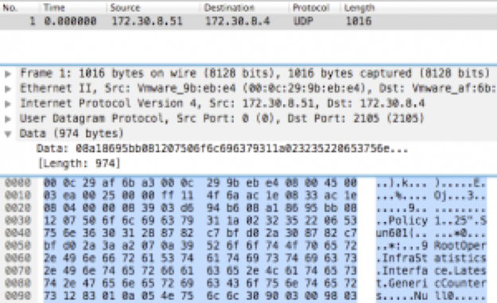
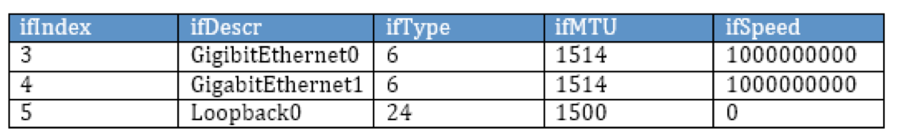

# Introducing Model-Driven telemetry

## What is Model-Driven Telemetry?

Telemetry and analytics are all the rage in networking today. The industry is abuzz with the potential unlocked by streaming vast quantities of operational data.  But what’s so special about “model-driven” telemetry on IOS-XR?

Models enable networking devices to precisely describe their capabilities to the outside world: what kind of data they expose (e.g. interfaces statistics, configuration options, etc), the data type (string, integer, etc), any restrictions on the data (optional or required, etc), and even what kind of operations are supported on the data.   The data model is like a contract, an agreement to obey instructions that conform to the model and return data according to the rules of the model.  This kind of contract is pure gold when it comes to writing applications.  You can explore data models offline using standard tools, automatically generate libraries and code, and write applications that will interact with the router in a predictable way.

Model-driven telemetry (MDT) leverages models in two ways.   

*  First, MDT is fully configurable using telemetry YANG models.  You can precisely specify what data to stream, to where, and with what encoding and transport using just the models, no CLI required.  If you’re ready to dig into the details, check out our step-by-step xrdocs tutorials on configuring MDT with the OpenConfig YANG telemetry model, the IOS XR native telemetry model, and even YDK.

* The second way that MDT leverages YANG data models is in the specification of the data to be streamed. The router measures a staggering number of parameters all the time – how do you tell it which subset you want?  With CLI, you memorized show commands.  With SNMP, you requested a MIB (To learn more about how telemetry improves on SNMP, check out this blog and watch this video).   With MDT, you specify the YANG model that contains the data you want.  Practically speaking, that means retrieving the supported models from the router real-time using a NETCONF <get-schema> operation or fetching them from github and exploring them offline using tools like pyang.  All published YANG operational models can be configured for streaming. You can find the latest YANG models supported by IOS-XR (per Release) on Github here:

 ><https://github.com/YangModels/yang/tree/master/vendor/cisco/xr>

So, in summary, MDT is special because it inherits the power of models, making it easier to define, consume and subscribe to the data you want. The goal of telemetry is to get as much data off the box as fast as possible.  By modeling that data with YANG, MDT ensures that those vast quantities of data are truly usable.

## The Limits of SNMP

### Not “New Data” But “New Ways of Getting Data”

When we work with customers to identify their biggest pain points with respect to network operational data, then the primary ask is usually not new types of data or fancy new counters. In fact, most useful data already exists in the network, it’s just too hard to get. The most frequent culprit? SNMP polling. Almost 30 years since it was first standardized, SNMP has done many good things but it hasn’t kept up with the speed and scale that modern networks require.

### Push Not Pull

We talk a lot about “push” being a better mechanism than “pull”, but what exactly does that mean? To retrieve large amounts of data, SNMP polling relies on the GetBulk operation. Introduced in SNMPv2, GetBulk performs a continuous GetNext operation that retrieves all the columns of a given table (e.g. statistics for all interfaces). The router will return as many columns as can fit into a packet (subject to the max-repetitions parameter). If the polling client detects that the end of the table has not yet been reached, it will do another GetBulk and so on.

Take a look at a packet trace for a GetBulk for interface statistics (the IF-Table of the IF-MIB). The router (172.30.8.51) responds with 70 OIDs in the first packet and the poller (172.30.8.11) does a second request for the remaining OIDs. On receiving the second request, the router continues its lexicographical walk and fills up another packet. When the poller detects that the router has “walked off the table” (by sending OIDs that belong to the next table), it stops sending GetBulks. For very large tables, this could take a lot of requests and the router has to process each one as it arrives.

This situation is bad enough if you have a single SNMP poller, but what if you have two or more polling stations (which most people do if only for redundancy)? The router has to process each request independently, finding the requested place in the lexical tree and doing the walk, even if both pollers requested the same MIB at more-or-less the same time. Many network operators know this empirically: the more pollers you have, the slower the SNMP response.

Telemetry gains efficiency over SNMP by eliminating the polling process altogether. Instead of sending requests with specific instructions that the router has to process each and every time, telemetry uses a configured policy to know what data to collect, how often and to whom it should be sent.

Take a look at a packet capture of interface statistics sent with telemetry using the compact Google Protocol Buffer encoding instead of SNMP. (This represents a superset of SNMP interface statistics since the router stores 36 statistics for every interface and the IF-Table has less.) At any rate, as you can see, all of the statistics fit into a single UDP packet. But the biggest gains have nothing to do with packet size. The really important thing is that the router does a single dip into the internal data structures to acquire the data and, if there are multiple interested receivers, the router can just duplicate the packet for different destinations (a simple and efficient operation for a router). So sending telemetry to one receiver has the same latency and overhead as sending it to five.

### Push Bags, Not Columns

Polling is not the only computational burden that SNMP imposes on a router. An equally significant performance factor is how data is ordered and exported.

SNMP imposes a very tight model when it comes to indexing and exporting. Take the example of the SNMP IF-Table. Each column of the table represents a different parameter for a given interface, indexed by the ifIndex. The first five columns are shown below:

  

The strict semantics of the GetNext/GetBulk operations force the router to traverse the table column by column (returning the list of ifIndex, followed by a list of ifDescr, etc) from lowest index value to highest. From a router’s perspective, that’s just not natural.

Not surprisingly, routers store internal data in a way that’s most efficient for routers. In IOS XR, for example, the internal data structure for interface statistics is indexed by interface name and is stored in a structure called a bag (basically, an unordered superset of the data in a row of the IF-Table above).  The router’s most efficient internal bulk data retrieval is to grab a whole bag (or, even better, bags) of data at once. But the router can’t just send the bag in SNMP. Instead, it has to re-order the data into a table and walk the columns to fulfill the GetBulk request. Now, the router can do all kinds of internal optimizations to make this process better (like auxiliary indices and caching techniques) but that all adds up to extra processing work and may also result in stale data.

How much better it would be if we could just free the router to present its data in the natural order! Well, that’s exactly what telemetry does. Telemetry collects data using the internal bulk data collection mechanisms, does some minimal processing to filter and translate the internal structure to a Google Protocol Buffer, and then pushes the whole thing to the collector at the configured intervals. We’ve worked hard to minimize processing overhead at every step, so you get the fastest, freshest data possible with the least amount of work.

### Bringing The Network Into Focus

After nearly 30 years, SNMP is nearly ubiquitous. Almost all modern network monitoring platforms rely on it to some degree or another. But for large-scale networks with real-time monitoring requirements, the fundamental operational characteristics of the SNMP protocol create bottlenecks that prevent valuable operational data from getting off the router. Model-driven telemetry frees the data from the constraints of SNMP and delivers it at a velocity that is often orders of magnitude better.
