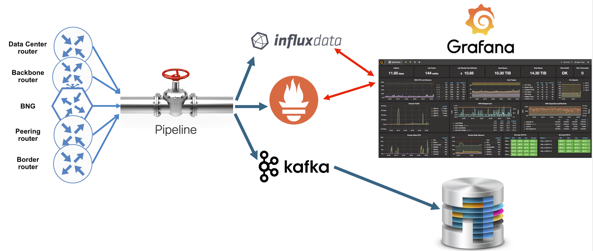

# Setting up a Telemetry Client/Collector


As a precursor to the rest of the labs in this module, let's consider the options available to set up a Telemetry client/collector that can receive Streaming data from the router.

## Open-Source tool: Pipeline

Pipeline is a flexible, multi-function collection service that is written in Go. It can ingest telemetry data from any XR release starting from 6.0.1. Pipeline’s input stages support raw UDP and TCP, as well as gRPC dial-in and dial-out capability. For encoding, Pipeline can consume JSON, compact GPB and self-describing GPB. On the output side, Pipeline can write the telemetry data to a text file as a JSON object, push the data to a Kafka bus and/or format it for consumption by open source stacks. Pipeline can easily be extended to include other output stages and we encourage contributions from anyone who wants to get involved.




It’s important to understand that Pipeline is not a complete big data analytics stack. Think of it as the first layer in a scalable, modular, analytics architecture. Depending on your use case, that architecture would also include separate components for big data storage, stream processing, analysis, alerting and visualization.


### Supported Capabilities

Pipeline is the most comprehensive tool available for IOS-XR telemetry data consumption. It is Golang–based code which consumes IOS XR telemetry streams directly from routers or indirectly from a pub/sub bus (Kafka). Once collected, Pipeline performs transformations of the data and forwards the result to the configured consumer.

Pipeline supports different input transport formats from routers (please be aware that multiple input modules of any type can run in parallel):

* TCP
* gRPC
* UDP
* Apache Kafka

Pipeline can support different encodings as well:

* (compact) GPB
* KV-GPB
* JSON

Pipeline can stream data to several different consumers. Supported downstream consumers include:

* InfluxDB (TSDB)
* Prometheus (TSDB)
* Apache Kafka
* dump-to-file (mostly for diagnostics purposes)


### Testing out pipeline

We will work with Pipeline in great detail in a subsequent lab in this module, but let's do a quick pipeline setup on the sandbox to show you how it works.

Pipeline is already running on the `devbox` inside a docker instance.
Connect to the devbox first:

<p style="margin: 2em 0!important;padding: 1em;font-family: CiscoSans,Arial,Helvetica,sans-serif;font-size: 1em !important;text-indent: initial;background-color: #e6f2f7;border-radius: 5px;box-shadow: 0 1px 1px rgba(0,127,171,0.25);">**Username**: admin<br/>**Password**: admin<br/>**SSH port**: 2211
</p>  

```
Laptop-terminal:$ ssh -p 2211 admin@10.10.20.170
admin@10.10.20.170's password:
Last login: Sat Aug 18 23:12:52 2018 from 192.168.122.1
admin@devbox:~$
admin@devbox:~$

```  

You will find a running docker instance:

```
admin@devbox:~$ docker ps
CONTAINER ID        IMAGE               COMMAND                  CREATED             STATUS              PORTS                    NAMES
47856e8174b8        pipeline:1.0.0      "/pipeline -log=/dat…"   16 minutes ago      Up 16 minutes       0.0.0.0:5432->5432/tcp   pipeline
admin@devbox:~$
```

This docker instance opens up a TCP port 5432 on the devbox. Exec into the docker instance and dump the pipeline.conf being utilized by the running pipeline process:


```

admin@devbox:~$
admin@devbox:~$ docker exec -it pipeline bash
root@47856e8174b8:/#
root@47856e8174b8:/# cat /data/pipeline.conf
##############################################
# Global bits of config in the default section
#
[default]

#
# ID is used to identify pipeline to third parties, e.g. fluentd tag
# and prometheus instance
id = pipeline

#
# Prometheus setup to export metrics about the pipeline. This is where
# prometheus will come and scrape metrics from. This configuration is
# only pertinent if you plan to monitor the pipeline itself using
# prometheus - and can be ignored. You can to comment out
# metamonitoring_prometheus_resource to stop from serving metrics.  If
# you do wish to monitor pipeline, tools/monitor/run.sh will fire
# prometheus and grafana with some prebuilt dashboards (requires
# docker). Point a browser at localhost:3000 as per
# https://github.com/grafana/grafana#running
#
metamonitoring_prometheus_resource = /metrics
metamonitoring_prometheus_server = :8989

# fluentd setup allows pipeline to export its logs in support of
# manageability at scale. Tag used is derived from ID
#
# fluentd = localhost:24224

# base_path_xlation
# This option points at a file which contains JSON base path mappings
# of base_path. This is typically used to morph PDT to MDT paths on
# input side where it makes sense (i.e. gpb and gpb codecs). Not
# applied to SNMP since base path is derived from snmp spec. (JSON is
# missing because today Telemetry header it not assumed for JSON
# inputs. This may change in the future.
# base_path_xlation=bpx.json

#
# Section start with a section name. The only constraint for section
# names is that 'default' is not used. You can have as many sections
# as you wish, as long as each section has a unique name.

##############################################
# Example of a TCP dialout (router connects to pipeline over TCP)
#
[testbed]
stage = xport_input
#
# Module type, the type dictates the rest of the options in the section.
# TCP can only be used as xport_iinput currently. UDP works similarly.
#
type = tcp
#
# Supported encapsulation is 'st' for streaming telemetry header. This
# is the header used to carry streaming telemetry payload in TCP and UDP.
#
encap = st
#
# TCP option dictating which binding to listen on. Can be a host name
# or address and port, or just port.
#
listen = :5432
#
# To enable dumping data as it is rxed, uncomment the following, and
# run with --debug option.
#
# logdata = on
#
# It is also possible to turn on TCP keepalives. Setting keepalive to
# 0 (default) stops pipeline from explicitly turning on
# keepalives. Otherwise, keepalive is turned on with period.  TCP
# Keepalives do NOT need any special explicit configuration or support
# from the other end.
#
# keepalive_seconds = 0


...........................# OUTPUT SNIPPED #............................


##############################################
# Example of a tap stage; dump content to file, or at least count messages
#
[inspector]
stage = xport_output
#
# Module type: tap is only supported in xport_output stage currently.
#
type = tap
#
# File to dump decoded messages
#
file = /data/dump.txt
#
# encoding = json
#
# Options: json_events | gpb, gpb_kv. If format is a binary format, or
# not supported for input encoding in use (gpb if proto is available,
# gpbk/v or JSON), we fall back to hex. Default is JSON
#

# raw = true
#
# If raw is set to true, no encoding should be specified. The outcome
# is that raw payload is dumped on top of a streaming telemetry
# header. The resulting archive can be replayed (i.e. reread and fed
# to output stages) by pipeline using the 'replay' input module.
#

# The optional buffered channel depth used to accommodate transient
# producer/consumer throughput.
#
datachanneldepth = 1000

# If all we want to do is count frames, set countonly to true
#
# countonly = false

#


...........................# OUTPUT SNIPPED #............................


```
It can be seen that pipeline is running, ready to receive TCP dial-out Telemetry data over TCP port 5432.  Further, the `[inspector]` stage is also active which implies that any data received by pipeline will get dumped into `/data/dump.txt` inside the container.


Further, to determine the reachable IP of devbox that router `r1` will be able to send traffic (behind the NAT), just dump `ifconfig eth0` on the devbox:

```
admin@devbox:~$ ifconfig eth0
eth0      Link encap:Ethernet  HWaddr 52:54:00:40:58:19  
          inet addr:192.168.122.11  Bcast:192.168.122.255  Mask:255.255.255.0
          inet6 addr: fe80::5054:ff:fe40:5819/64 Scope:Link
          UP BROADCAST RUNNING MULTICAST  MTU:1500  Metric:1
          RX packets:299093 errors:0 dropped:6 overruns:0 frame:0
          TX packets:166647 errors:0 dropped:0 overruns:0 carrier:0
          collisions:0 txqueuelen:1000
          RX bytes:801226695 (801.2 MB)  TX bytes:21776268 (21.7 MB)

admin@devbox:~$

```

Perfect! So the router `r1` must be configured to send data to pipeline at `192.168.122.11:5432`.


Let's connect to router r1 and configure TCP dial-out as needed:


<p style="margin: 2em 0!important;padding: 1em;font-family: CiscoSans,Arial,Helvetica,sans-serif;font-size: 1em !important;text-indent: initial;background-color: #e6f2f7;border-radius: 5px;box-shadow: 0 1px 1px rgba(0,127,171,0.25);">**Username**: admin<br/>**Password**: admin<br/>**SSH port**: 2221
</p>  

```
Laptop-terminal:$ ssh -p 2221 admin@10.10.20.170


--------------------------------------------------------------------------
  Router 1 (Cisco IOS XR Sandbox)
--------------------------------------------------------------------------


Password:


RP/0/RP0/CPU0:r1#
RP/0/RP0/CPU0:r1#
```

Remove existing telemetry configurations from `r1`:

```
RP/0/RP0/CPU0:r1#
RP/0/RP0/CPU0:r1#conf t
Tue Sep  4 08:01:03.269 UTC
RP/0/RP0/CPU0:r1(config)#no telemetry model-driven
RP/0/RP0/CPU0:r1(config)#commit
Tue Sep  4 08:01:06.422 UTC
RP/0/RP0/CPU0:r1(config)#
RP/0/RP0/CPU0:r1#
RP/0/RP0/CPU0:r1#

```

Configure TCP dial-out for destination 192.168.122.11:5432. The required configuration is:

```
telemetry model-driven
 destination-group DGroup1
  address-family ipv4 192.168.122.11 port 5432
   encoding self-describing-gpb
   protocol tcp
  !
 !
 sensor-group SGroup1
  sensor-path Cisco-IOS-XR-infra-statsd-oper:infra-statistics/interfaces/interface/latest/generic-counters
 !
 subscription Sub1
  sensor-group-id SGroup1 sample-interval 30000
  destination-id DGroup1
 !
!  
```

The sensor path selected is `Cisco-IOS-XR-infra-statsd-oper:infra-statistics/interfaces/interface/latest/generic-counters` to send periodict interface counters to the pipeline instance.  

Once the configuration is applied, we can validate that the configured destination group `DGroup1` goes active immediately:

```
RP/0/RP0/CPU0:r1#show  telemetry model-driven destination DGroup1
Tue Sep  4 10:33:31.290 UTC
  Destination Group:  DGroup1
  -----------------
    Destination IP:       192.168.122.11
    Destination Port:     5432
    Subscription:         Sub1
    State:                Active
    Encoding:             self-describing-gpb
    Transport:            tcp
    No TLS                
    Total bytes sent:     15884
    Total packets sent:   2
    Last Sent time:       2018-09-04 10:33:12.793942166 +0000

    Collection Groups:
    ------------------
      Id: 32
      Sample Interval:      30000 ms
    Encoding:             self-describing-gpb
      Num of collection:    2
      Collection time:      Min:    16 ms Max:    23 ms
      Total time:           Min:    16 ms Max:    24 ms Avg:    20 ms
      Total Deferred:       0
      Total Send Errors:    0
      Total Send Drops:     0
      Total Other Errors:   0
    No data Instances:    0
      Last Collection Start:2018-09-04 10:33:12.793919166 +0000
      Last Collection End:  2018-09-04 10:33:12.793943166 +0000
      Sensor Path:          Cisco-IOS-XR-infra-statsd-oper:infra-statistics/interfaces/interface/latest/generic-counters

RP/0/RP0/CPU0:r1#


```


Finally, log back into `devbox`  and start a `tail -f` on the file `/data/dump.txt` over `docker exec` to the pipeline instance:

<p><pre><code>
admin@devbox:~$ <mark>docker exec -it pipeline tail -f</mark> /data/dump.txt</mark>
                "runt-packets-received": 0,
                "seconds-since-last-clear-counters": 0,
                "seconds-since-packet-received": 0,
                "seconds-since-packet-sent": 0,
                "throttled-packets-received": 0,
                "unknown-protocol-packets-received": 0
            }
        }
    ]
}


------- 2018-09-04 10:35:46.161473351 +0000 UTC -------
Summary: GPB(common) Message [192.168.122.21:28927(r1)/Cisco-IOS-XR-infra-statsd-oper:infra-statistics/interfaces/interface/latest/generic-counters msg len: 7930]
{
    "Source": "192.168.122.21:28927",
    "Telemetry": {
        "node_id_str": "r1",
        "subscription_id_str": "Sub1",
        "encoding_path": "Cisco-IOS-XR-infra-statsd-oper:infra-statistics/interfaces/interface/latest/generic-counters",
        "collection_id": 192,
        "collection_start_time": 1536057342750,
        "msg_timestamp": 1536057342750,
        "collection_end_time": 1536057342775
    },
    "Rows": [
        {
            "Timestamp": 1536057342771,
            "Keys": {
                "interface-name": "Null0"
            },
            "Content": {
                "applique": 0,
                "availability-flag": 0,
                "broadcast-packets-received": 0,
                "broadcast-packets-sent": 0,
                "bytes-received": 0,
                "bytes-sent": 0,
                "carrier-transitions": 0,
                "crc-errors": 0,
                "framing-errors-received": 0,
                "giant-packets-received": 0,
                "input-aborts": 0,
                "input-drops": 0,
                "input-errors": 0,
                "input-ignored-packets": 0,
                "input-overruns": 0,
                "input-queue-drops": 0,
                "last-data-time": 1536057325,
                "last-discontinuity-time": 1535959162,
                "multicast-packets-received": 0,
                "multicast-packets-sent": 0,
                "output-buffer-failures": 0,
                "output-buffers-swapped-out": 0,
                "output-drops": 0,
                "output-errors": 0,
                "output-queue-drops": 0,
                "output-underruns": 0,
                "packets-received": 0,
                "packets-sent": 0,
                "parity-packets-received": 0,
                "resets": 0,
                "runt-packets-received": 0,
                "seconds-since-last-clear-counters": 0,
                "seconds-since-packet-received": 4294967295,
                "seconds-since-packet-sent": 4294967295,
                "throttled-packets-received": 0,
                "unknown-protocol-packets-received": 0
            }
        },

  .............................# OUTPUT SNIPPED #.........................

</code></pre></p>


## Building your own clients

We learnt in the earlier sections that IOS-XR supports streaming Telemetry data over raw TCP (dial-out) and gRPC (dial-in and dial-out). The structure of the streamable data is derived from Oper YANG models.

Now, these Oper Yang-models can also be mapped to equivalent protobuf models, represented in `.proto` files.
This is especially useful when we need to write a Telemetry client code from scratch.
By exposing these protobuf-based capabilities over a gRPC connection, it enables a user to utilize gRPC's intrinsic architecture to generate bindings(code/libraries) in a language of choice (python, c++, golang etc.).

To view the .proto files corresponding to the Oper Yang models in XR, clone the following git repo on the `devbox` and peek into the `proto_archive/` directory:

><https://github.com/akshshar/bigmuddy-network-telemetry-proto>  

```
admin@devbox:~$
admin@devbox:~$
admin@devbox:~$ git clone https://github.com/cisco/bigmuddy-network-telemetry-proto
Cloning into 'bigmuddy-network-telemetry-proto'...
remote: Counting objects: 11287, done.
remote: Total 11287 (delta 0), reused 0 (delta 0), pack-reused 11287
Receiving objects: 100% (11287/11287), 2.96 MiB | 1.94 MiB/s, done.
Resolving deltas: 100% (3595/3595), done.
Checking connectivity... done.
admin@devbox:~$
admin@devbox:~$
admin@devbox:~$
admin@devbox:~$ cd bigmuddy-network-telemetry-proto/proto_archive/
admin@devbox:proto_archive$ ls -l
total 1744
drwxrwxr-x 3 admin admin    4096 Sep  3 05:01 cisco_ios_xr_aaa_locald_oper
drwxrwxr-x 3 admin admin    4096 Sep  3 05:01 cisco_ios_xr_aaa_protocol_radius_oper
drwxrwxr-x 3 admin admin    4096 Sep  3 05:01 cisco_ios_xr_alarmgr_server_oper
drwxrwxr-x 3 admin admin    4096 Sep  3 05:01 cisco_ios_xr_bundlemgr_oper
drwxrwxr-x 3 admin admin    4096 Sep  3 05:01 cisco_ios_xr_cdp_oper
drwxrwxr-x 3 admin admin    4096 Sep  3 05:01 cisco_ios_xr_clns_isis_oper
drwxrwxr-x 3 admin admin    4096 Sep  3 05:01 cisco_ios_xr_controller_optics_oper
drwxrwxr-x 3 admin admin    4096 Sep  3 05:01 cisco_ios_xr_controller_otu_oper
drwxrwxr-x 3 admin admin    4096 Sep  3 05:01 cisco_ios_xr_crypto_sam_oper
drwxrwxr-x 3 admin admin    4096 Sep  3 05:01 cisco_ios_xr_dpt_telemetry_oper
drwxrwxr-x 3 admin admin    4096 Sep  3 05:01 cisco_ios_xr_drivers_media_eth_oper
drwxrwxr-x 3 admin admin    4096 Sep  3 05:01 cisco_ios_xr_es_acl_oper
drwxrwxr-x 3 admin admin    4096 Sep  3 05:01 cisco_ios_xr_ethernet_lldp_oper
drwxrwxr-x 5 admin admin    4096 Sep  3 05:01 cisco_ios_xr_fib_common_oper
drwxrwxr-x 4 admin admin    4096 Sep  3 05:01 cisco_ios_xr_ifmgr_oper
drwxrwxr-x 3 admin admin    4096 Sep  3 05:01 cisco_ios_xr_infra_alarm_logger_oper
drwxrwxr-x 4 admin admin    4096 Sep  3 05:01 cisco_ios_xr_infra_correlator_oper
drwxrwxr-x 3 admin admin    4096 Sep  3 05:01 cisco_ios_xr_infra_objmgr_oper
drwxrwxr-x 3 admin admin    4096 Sep  3 05:01 cisco_ios_xr_infra_policymgr_oper
drwxrwxr-x 3 admin admin    4096 Sep  3 05:01 cisco_ios_xr_infra_rcmd_oper
drwxrwxr-x 3 admin admin    4096 Sep  3 05:01 cisco_ios_xr_infra_rmf_oper
drwxrwxr-x 5 admin admin    4096 Sep  3 05:01 cisco_ios_xr_infra_rsi_oper
drwxrwxr-x 3 admin admin    4096 Sep  3 05:01 cisco_ios_xr_infra_statsd_oper
drwxrwxr-x 3 admin admin    4096 Sep  3 05:01 cisco_ios_xr_infra_syslog_oper
drwxrwxr-x 3 admin admin    4096 Sep  3 05:01 cisco_ios_xr_infra_tc_oper
drwxrwxr-x 3 admin admin    4096 Sep  3 05:01 cisco_ios_xr_invmgr_oper
drwxrwxr-x 3 admin admin    4096 Sep  3 05:01 cisco_ios_xr_ip_bfd_oper
drwxrwxr-x 3 admin admin    4096 Sep  3 05:01 cisco_ios_xr_ip_domain_oper
drwxrwxr-x 3 admin admin    4096 Sep  3 05:01 cisco_ios_xr_ip_iep_oper
drwxrwxr-x 3 admin admin    4096 Sep  3 05:01 cisco_ios_xr_ip_ntp_oper
drwxrwxr-x 4 admin admin    4096 Sep  3 05:01 cisco_ios_xr_ip_rib_ipv4_oper
drwxrwxr-x 4 admin admin    4096 Sep  3 05:01 cisco_ios_xr_ip_rib_ipv6_oper
drwxrwxr-x 4 admin admin    4096 Sep  3 05:01 cisco_ios_xr_ip_rsvp_oper
drwxrwxr-x 5 admin admin    4096 Sep  3 05:01 cisco_ios_xr_ip_tcp_oper
drwxrwxr-x 4 admin admin    4096 Sep  3 05:01 cisco_ios_xr_ip_udp_oper
drwxrwxr-x 3 admin admin    4096 Sep  3 05:01 cisco_ios_xr_ipv4_acl_oper
drwxrwxr-x 4 admin admin    4096 Sep  3 05:01 cisco_ios_xr_ipv4_arp_oper
drwxrwxr-x 3 admin admin    4096 Sep  3 05:01 cisco_ios_xr_ipv4_bgp_oper
drwxrwxr-x 3 admin admin    4096 Sep  3 05:01 cisco_ios_xr_ipv4_hsrp_oper
drwxrwxr-x 3 admin admin    4096 Sep  3 05:01 cisco_ios_xr_ipv4_io_oper
drwxrwxr-x 3 admin admin    4096 Sep  3 05:01 cisco_ios_xr_ipv4_ospf_oper
drwxrwxr-x 3 admin admin    4096 Sep  3 05:01 cisco_ios_xr_ipv4_vrrp_oper
drwxrwxr-x 3 admin admin    4096 Sep  3 05:01 cisco_ios_xr_ipv6_acl_oper
drwxrwxr-x 3 admin admin    4096 Sep  3 05:01 cisco_ios_xr_ipv6_io_oper
drwxrwxr-x 3 admin admin    4096 Sep  3 05:01 cisco_ios_xr_ipv6_ma_oper
drwxrwxr-x 3 admin admin    4096 Sep  3 05:01 cisco_ios_xr_ipv6_nd_oper
drwxrwxr-x 3 admin admin    4096 Sep  3 05:01 cisco_ios_xr_ipv6_new_dhcpv6d_oper
drwxrwxr-x 3 admin admin    4096 Sep  3 05:01 cisco_ios_xr_ipv6_ospfv3_oper
drwxrwxr-x 5 admin admin    4096 Sep  3 05:01 cisco_ios_xr_l2_eth_infra_oper
drwxrwxr-x 6 admin admin    4096 Sep  3 05:01 cisco_ios_xr_l2vpn_oper
drwxrwxr-x 3 admin admin    4096 Sep  3 05:01 cisco_ios_xr_lib_keychain_oper
drwxrwxr-x 3 admin admin    4096 Sep  3 05:01 cisco_ios_xr_lib_mpp_oper
drwxrwxr-x 3 admin admin    4096 Sep  3 05:01 cisco_ios_xr_linux_os_reboot_history_oper
drwxrwxr-x 3 admin admin    4096 Sep  3 05:01 cisco_ios_xr_manageability_object_tracking_oper
drwxrwxr-x 3 admin admin    4096 Sep  3 05:01 cisco_ios_xr_manageability_perfmgmt_oper
drwxrwxr-x 3 admin admin    4096 Sep  3 05:01 cisco_ios_xr_man_ems_oper
drwxrwxr-x 4 admin admin    4096 Sep  3 05:01 cisco_ios_xr_man_xml_ttyagent_oper
drwxrwxr-x 3 admin admin    4096 Sep  3 05:01 cisco_ios_xr_mpls_ldp_oper
drwxrwxr-x 4 admin admin    4096 Sep  3 05:01 cisco_ios_xr_mpls_lsd_oper
drwxrwxr-x 3 admin admin    4096 Sep  3 05:01 cisco_ios_xr_mpls_static_oper
drwxrwxr-x 9 admin admin    4096 Sep  3 05:01 cisco_ios_xr_mpls_te_oper
drwxrwxr-x 3 admin admin    4096 Sep  3 05:01 cisco_ios_xr_mpls_vpn_oper
drwxrwxr-x 3 admin admin    4096 Sep  3 05:01 cisco_ios_xr_nto_misc_oper
drwxrwxr-x 3 admin admin    4096 Sep  3 05:01 cisco_ios_xr_pbr_oper
drwxrwxr-x 3 admin admin    4096 Sep  3 05:01 cisco_ios_xr_pbr_vservice_ea_oper
drwxrwxr-x 3 admin admin    4096 Sep  3 05:01 cisco_ios_xr_pbr_vservice_mgr_oper
drwxrwxr-x 3 admin admin    4096 Sep  3 05:01 cisco_ios_xr_pfi_im_cmd_oper
drwxrwxr-x 4 admin admin    4096 Sep  3 05:01 cisco_ios_xr_plat_chas_invmgr_oper
drwxrwxr-x 4 admin admin    4096 Sep  3 05:01 cisco_ios_xr_pmengine_oper
drwxrwxr-x 3 admin admin    4096 Sep  3 05:01 cisco_ios_xr_policy_repository_oper
drwxrwxr-x 3 admin admin    4096 Sep  3 05:01 cisco_ios_xr_qos_ma_oper
drwxrwxr-x 3 admin admin    4096 Sep  3 05:01 cisco_ios_xr_rgmgr_oper
drwxrwxr-x 3 admin admin    4096 Sep  3 05:01 cisco_ios_xr_sdr_invmgr_diag_oper
drwxrwxr-x 3 admin admin    4096 Sep  3 05:01 cisco_ios_xr_segment_routing_ms_oper
drwxrwxr-x 3 admin admin    4096 Sep  3 05:01 cisco_ios_xr_shellutil_filesystem_oper
drwxrwxr-x 3 admin admin    4096 Sep  3 05:01 cisco_ios_xr_shellutil_oper
drwxrwxr-x 3 admin admin    4096 Sep  3 05:01 cisco_ios_xr_snmp_agent_oper
drwxrwxr-x 3 admin admin    4096 Sep  3 05:01 cisco_ios_xr_spirit_install_instmgr_oper
drwxrwxr-x 3 admin admin    4096 Sep  3 05:01 cisco_ios_xr_telemetry_model_driven_oper
drwxrwxr-x 3 admin admin    4096 Sep  3 05:01 cisco_ios_xr_tty_management_cmd_oper
drwxrwxr-x 3 admin admin    4096 Sep  3 05:01 cisco_ios_xr_tty_server_oper
drwxrwxr-x 3 admin admin    4096 Sep  3 05:01 cisco_ios_xr_wanphy_ui_oper
drwxrwxr-x 3 admin admin    4096 Sep  3 05:01 cisco_ios_xr_wdsysmon_fd_oper
-rw-rw-r-- 1 admin admin 1342807 Sep  3 05:01 cisco_ios_xr_yang2proto_map.json
drwxrwxr-x 2 admin admin    4096 Sep  3 05:01 mdt_grpc_dialin
drwxrwxr-x 2 admin admin    4096 Sep  3 05:01 mdt_grpc_dialout
-rw-rw-r-- 1 admin admin   80949 Sep  3 05:01 noschema
drwxrwxr-x 4 admin admin    4096 Sep  3 05:01 old
-rw-rw-r-- 1 admin admin    8187 Sep  3 05:01 telemetry.proto  
```

This represents all the available Oper Yang models arranged as folders containing the .proto files.
We can generate bindings in the language of choice (python, c++, golang etc.) using these .proto files and leverage the bindings to subscribe to the router's Telemetry stream as well as decode the data received. We will delve into these scenarios and write our own Telemetry client/collector in subsequent labs in this module.


<p style="margin: 2em 0!important;padding: 1em;font-family: CiscoSans,Arial,Helvetica,sans-serif;font-size: 1em !important;text-indent: initial;background-color: #eff9ef;border-radius: 5px;box-shadow: 0 1px 1px rgba(0,127,171,0.25);">Perfect! This lab should give the reader sufficient background on the concepts of Streaming Telemetry in IOS-XR with an eye on the possibilities that can be explored.
</p>  
