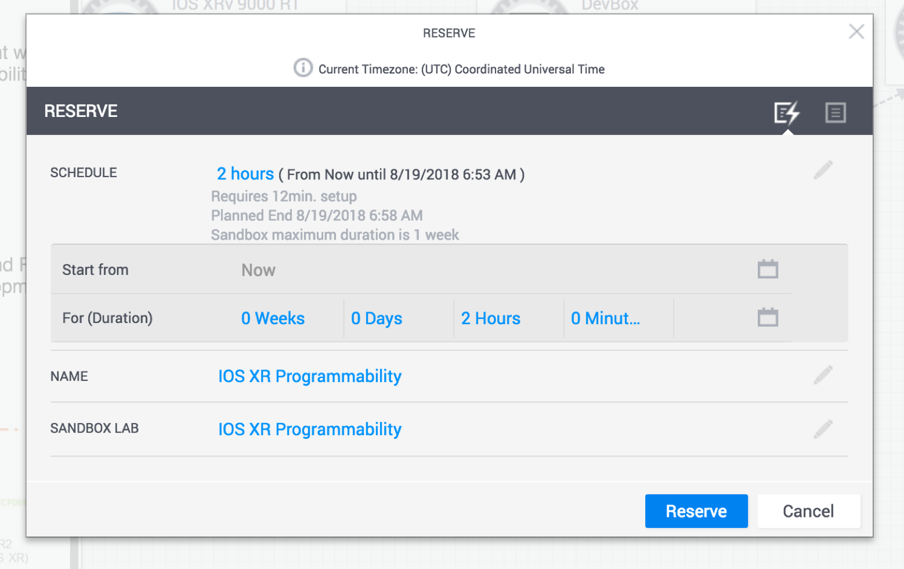

# Before we Begin
In this lab, we learn how Streaming Telemetry capabilities in IOS-XR can be easily integrated with your own gRPC client written by utilizing IOS-XR specific .proto files mapped to operational YANG models, enabling you to write seamless code in the language of your choice as you integrate real-time Telemetry in your workflow.


## Objectives

* Reserve and Familiarize yourself with the IOS-XR Devnet Sandbox
* Configure Model Driven Telemetry (Dial-in gRPC) on the Router
* Install gRPC and generate bindings from proto files
* Client Code: Run existing c++ client/collector code
* Client Code: Deconstruct the c++ client code and learn how to write your own.


## Prerequisites

### Reserve the IOS-XR Programmability sandbox

Take some time to reserve and familiarize yourself with the [IOS-XR programmability Sandbox on Devnet](https://devnetsandbox.cisco.com/RM/Diagram/Index/883f8ea6-54a1-453e-98f5-fc175a2a90de?diagramType=Topology).
Getting started is pretty straightforward - once you hit the above URL, click on the `Reserve` button on the top right:


<p style="margin: 2em 0 !important;padding: 1em;font-family: CiscoSans,Arial,Helvetica,sans-serif;font-size: 1em !important;text-indent: initial;background-color: #fdefef;border-radius: 5px;box-shadow: 0 1px 1px rgba(0,127,171,0.25);"> You will need to be logged in to <https://devnetsandbox.cisco.com/> before you can reserve.
</p>

As part of the reservation, select the duration for which you'd like to reserve the sandbox (maximum duration = 1 week).

.

<p style="margin: 2em 0 !important;padding: 1em;font-family: CiscoSans,Arial,Helvetica,sans-serif;font-size: 1em !important;text-indent: initial;background-color: #e6f2f7;border-radius: 5px;box-shadow: 0 1px 1px rgba(0,127,171,0.25);"> To view the dropdown menu with variable reservation options, hit the edit button (pencil icon) next to schedule. Once your reservation is active, you can keep extending the duration if you start running out of time (with the maximum limit set to a total time of 1 week)</p>

Once reserved, expect an initial email (associated with your login) indicating that your sandbox environment is being set up.   
Within about 10 minutes, the entire sandbox environment should be ready and you'll get another email detailing the [Anyconnect](https://developer.cisco.com/site/devnet/sandbox/anyconnect/) server and credential information you need to connect to the same network as the sandbox environment.

These instructions and more are detailed here: [Reserving and Connecting to a Devnet Sandbox](https://developer.cisco.com/docs/sandbox/#!first-reservation-guide/connect-to-sandbox-servers).

### Connect to the Sandbox

Once you're connected to the Anyconnect server:

<br/><br/>

You should be able to ping the address: `10.10.20.170` which represents the External NAT address of the virtualization host on which the IOS-XRv9000 instances and the development environment (devbox) are running.  


More details can be found at the [IOS-XR programmability Sandbox](https://devnetsandbox.cisco.com/RM/Diagram/Index/883f8ea6-54a1-453e-98f5-fc175a2a90de?diagramType=Topology) link.

The topology that you will have access to is shown below:    

<br/><br/><br/>

You have SSH access to each of the virtual machines - the two IOS-XRv9000 instances (r1 and r2) and the devbox (an Ubuntu 16.04 instance for access to a development environment).

Further, some special ports (**Netconf port**: `830`, **gRPC port**: `57777`, and **XR-Bash-SSH port**: `57722`) for each of the routers r1 and r2 have been uniquely forwarded to the external NAT IP: `10.10.20.170` as shown in the figure above.

<br/><br/>
To be clear, the connection details are listed below:


|Developer Box (devbox)||
| ------------- |:-------------|
|IP|10.10.20.170 (Post VPN connection)|
|SSH Port| 2211 |
|Username| admin |
|Password| admin|

<br/>


|IOS-XRv9000 R1||
| ------------- |:-------------|
|IP|10.10.20.170 (Post VPN connection) |
|XR-SSH Port| 2221 |
|NETCONF Port| 8321 |
|gRPC Port| 57021 |
|XR-Bash SSH Port| 2222|
|Username| admin |
|Password| admin|

<br/>

|IOS-XRv9000 R2||
| ------------- |:-------------|
|IP|10.10.20.170 (Post VPN connection)|
|XR-SSH Port| 2231 |
|NETCONF Port| 8331 |
|gRPC Port| 57031 |
|XR-Bash SSH Port| 2232|
|Username| admin |
|Password| admin|

<br/><br/><br/>  


### Connect to the nodes in the Topology

To connect to the nodes in the topology, you have 3 options:

#### Browser Based:  
If you don't have an SSH Client or Terminal available on your Laptop/Machine that you're using to walk through this lab, then use the UI that Devnet Sandbox provides to connect to the instances within your browser (Chrome or Firefox).
Just hover over a node in the topology and hit `SSH` from the dropdown menu. This is shown below for the `devbox`:


<p style="margin: 2em 0 !important;padding: 1em;font-family: CiscoSans,Arial,Helvetica,sans-serif;font-size: 1em !important;text-indent: initial;background-color: #e6f2f7;border-radius: 5px;box-shadow: 0 1px 1px rgba(0,127,171,0.25);">**Pro Tip**: This browser based session uses [Guacamole](https://guacamole.apache.org/) on the server side to serve up the SSH connection. If you'd like to enable easy copy-paste from your laptop/machine into the session in the browser, then use `Chrome` as your browser and install the following [plugin](https://chrome.google.com/webstore/detail/clipboard-permission-mana/ipbhneeanpgkaleihlknhjiaamobkceh?hl=en). Once installed, then within the browser tab that has the SSH session open, enable clipboard copying by clicking the plugin icon on the top right and allowing clipboard permissions for the particular host/IP as shown below:
<br/>
</p>

&nbsp;  

#### SSH CLient:
If you have a 3rd party SSH client, use the SSH ports as described in the previous section to connect to the node of your choice. IP address is the same for all the nodes: `10.10.20.170`

&nbsp;  

#### Terminal:  
If you have a Terminal to work with (with an SSH client utility), then to connect to the **devbox**, run:
<p style="margin: 2em 0!important;padding: 1em;font-family: CiscoSans,Arial,Helvetica,sans-serif;font-size: 1em !important;text-indent: initial;background-color: #e6f2f7;border-radius: 5px;box-shadow: 0 1px 1px rgba(0,127,171,0.25);">**Username**: admin<br/>**Password**: admin<br/>**SSH port**: 2211
</p>  

```
Laptop-terminal:$ ssh -p 2211 admin@10.10.20.170
admin@10.10.20.170's password:
Last login: Sat Aug 18 23:12:52 2018 from 192.168.122.1
admin@devbox:~$
admin@devbox:~$

```  

Or to connect to **router r1**:  

<p style="margin: 2em 0!important;padding: 1em;font-family: CiscoSans,Arial,Helvetica,sans-serif;font-size: 1em !important;text-indent: initial;background-color: #e6f2f7;border-radius: 5px;box-shadow: 0 1px 1px rgba(0,127,171,0.25);">**Username**: admin<br/>**Password**: admin<br/>**SSH port**: 2221
</p>  

```
Laptop-terminal:$ ssh -p 2221 admin@10.10.20.170


--------------------------------------------------------------------------
  Router 1 (Cisco IOS XR Sandbox)
--------------------------------------------------------------------------


Password:


RP/0/RP0/CPU0:r1#
RP/0/RP0/CPU0:r1#
RP/0/RP0/CPU0:r1#
RP/0/RP0/CPU0:r1#show version
Sun Aug 19 07:10:06.826 UTC

Cisco IOS XR Software, Version 6.4.1
Copyright (c) 2013-2017 by Cisco Systems, Inc.

Build Information:
 Built By     : nkhai
 Built On     : Wed Mar 28 19:20:20 PDT 2018
 Build Host   : iox-lnx-090
 Workspace    : /auto/srcarchive14/prod/6.4.1/xrv9k/ws
 Version      : 6.4.1
 Location     : /opt/cisco/XR/packages/

cisco IOS-XRv 9000 () processor
System uptime is 1 day, 13 hours, 30 minutes

RP/0/RP0/CPU0:r1#


```


<p style="margin: 2em 0!important;padding: 1em;font-family: CiscoSans,Arial,Helvetica,sans-serif;font-size: 1em !important;text-indent: initial;background-color: #eff9ef;border-radius: 5px;box-shadow: 0 1px 1px rgba(0,127,171,0.25);">Perfect! You are now all set to start this lab.
</p>  
