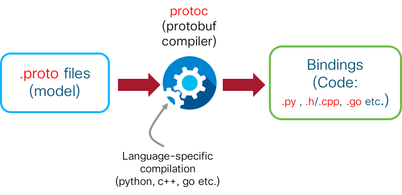

# Client Code: Install gRPC and regenerate bindings

We will develop the telemetry client on the `devbox`. The Telemetry client will connect to the router over gRPC. So, the steps we intend to perform as part of this section are:

*  **Install the protoc compiler** (Python-pip provides protoc using a `grpc-tools` package that we intend to use. Alternatively `protoc` can be built using protobuf:3.5.0 package from github.).  

*  Provide the appropriate model (.proto) file mapped to the router's yang model to the compiler and **generate bindings** (i.e. actual code in the form of .py files from the .proto files). This generated code is then used as a set of libraries to create our own client code.  

The process is depicted below:  




## Connect to the Devbox

Connection details are explained in the beginning of this lab. SSH into devbox:  

<p style="margin: 2em 0!important;padding: 1em;font-family: CiscoSans,Arial,Helvetica,sans-serif;font-size: 1em !important;text-indent: initial;background-color: #e6f2f7;border-radius: 5px;box-shadow: 0 1px 1px rgba(0,127,171,0.25);">**Username**: admin<br/>**Password**: admin<br/>**SSH port**: 2211
</p>  


```
Laptop-Terminal:$ ssh -p 2211 admin@10.10.20.170
admin@10.10.20.170's password:
Last login: Sun Aug 26 19:18:39 2018 from 192.168.122.1
admin@devbox:~$
admin@devbox:~$

```  


## IOS-XR Telemetry gRPC proto files

Streaming Telemetry in IOS-XR is normally understood as a technique of pushing operational information from an IOS-XR router by using  Yang-models to set up sensor-paths and Subscriptions that clients can subscribe to and receive information from.

However, these Oper Yang-models can also be mapped to equivalent protobuf models, represented in `.proto` files.
This is especially useful when we need to write a Telemetry client code from scratch.
By exposing these protobuf-based capabilities over a gRPC connection, it enables a user to utilize gRPC's intrinsic architecture to generate bindings(code/libraries) in a language of choice (python, c++, golang etc.).

To view the .proto files corresponding to the Oper Yang models in XR, clone the following git repo on the devbox and peek into the `proto_archive/` directory:

><https://github.com/akshshar/bigmuddy-network-telemetry-proto>  

```
admin@devbox:~$
admin@devbox:~$
admin@devbox:~$ git clone https://github.com/cisco/bigmuddy-network-telemetry-proto
Cloning into 'bigmuddy-network-telemetry-proto'...
remote: Counting objects: 11287, done.
remote: Total 11287 (delta 0), reused 0 (delta 0), pack-reused 11287
Receiving objects: 100% (11287/11287), 2.96 MiB | 1.94 MiB/s, done.
Resolving deltas: 100% (3595/3595), done.
Checking connectivity... done.
admin@devbox:~$
admin@devbox:~$
admin@devbox:~$
admin@devbox:~$ cd bigmuddy-network-telemetry-proto/proto_archive/
admin@devbox:proto_archive$ ls
cisco_ios_xr_aaa_locald_oper           cisco_ios_xr_infra_alarm_logger_oper  cisco_ios_xr_ip_rib_ipv4_oper  cisco_ios_xr_ipv6_nd_oper                        cisco_ios_xr_mpls_te_oper               cisco_ios_xr_shellutil_oper
cisco_ios_xr_aaa_protocol_radius_oper  cisco_ios_xr_infra_correlator_oper    cisco_ios_xr_ip_rib_ipv6_oper  cisco_ios_xr_ipv6_new_dhcpv6d_oper               cisco_ios_xr_mpls_vpn_oper              cisco_ios_xr_snmp_agent_oper
cisco_ios_xr_alarmgr_server_oper       cisco_ios_xr_infra_objmgr_oper        cisco_ios_xr_ip_rsvp_oper      cisco_ios_xr_ipv6_ospfv3_oper                    cisco_ios_xr_nto_misc_oper              cisco_ios_xr_spirit_install_instmgr_oper
cisco_ios_xr_bundlemgr_oper            cisco_ios_xr_infra_policymgr_oper     cisco_ios_xr_ip_tcp_oper       cisco_ios_xr_l2_eth_infra_oper                   cisco_ios_xr_pbr_oper                   cisco_ios_xr_telemetry_model_driven_oper
cisco_ios_xr_cdp_oper                  cisco_ios_xr_infra_rcmd_oper          cisco_ios_xr_ip_udp_oper       cisco_ios_xr_l2vpn_oper                          cisco_ios_xr_pbr_vservice_ea_oper       cisco_ios_xr_tty_management_cmd_oper
cisco_ios_xr_clns_isis_oper            cisco_ios_xr_infra_rmf_oper           cisco_ios_xr_ipv4_acl_oper     cisco_ios_xr_lib_keychain_oper                   cisco_ios_xr_pbr_vservice_mgr_oper      cisco_ios_xr_tty_server_oper
cisco_ios_xr_controller_optics_oper    cisco_ios_xr_infra_rsi_oper           cisco_ios_xr_ipv4_arp_oper     cisco_ios_xr_lib_mpp_oper                        cisco_ios_xr_pfi_im_cmd_oper            cisco_ios_xr_wanphy_ui_oper
cisco_ios_xr_controller_otu_oper       cisco_ios_xr_infra_statsd_oper        cisco_ios_xr_ipv4_bgp_oper     cisco_ios_xr_linux_os_reboot_history_oper        cisco_ios_xr_plat_chas_invmgr_oper      cisco_ios_xr_wdsysmon_fd_oper
cisco_ios_xr_crypto_sam_oper           cisco_ios_xr_infra_syslog_oper        cisco_ios_xr_ipv4_hsrp_oper    cisco_ios_xr_manageability_object_tracking_oper  cisco_ios_xr_pmengine_oper              cisco_ios_xr_yang2proto_map.json
cisco_ios_xr_dpt_telemetry_oper        cisco_ios_xr_infra_tc_oper            cisco_ios_xr_ipv4_io_oper      cisco_ios_xr_manageability_perfmgmt_oper         cisco_ios_xr_policy_repository_oper     mdt_grpc_dialin
cisco_ios_xr_drivers_media_eth_oper    cisco_ios_xr_invmgr_oper              cisco_ios_xr_ipv4_ospf_oper    cisco_ios_xr_man_ems_oper                        cisco_ios_xr_qos_ma_oper                mdt_grpc_dialout
cisco_ios_xr_es_acl_oper               cisco_ios_xr_ip_bfd_oper              cisco_ios_xr_ipv4_vrrp_oper    cisco_ios_xr_man_xml_ttyagent_oper               cisco_ios_xr_rgmgr_oper                 noschema
cisco_ios_xr_ethernet_lldp_oper        cisco_ios_xr_ip_domain_oper           cisco_ios_xr_ipv6_acl_oper     cisco_ios_xr_mpls_ldp_oper                       cisco_ios_xr_sdr_invmgr_diag_oper       old
cisco_ios_xr_fib_common_oper           cisco_ios_xr_ip_iep_oper              cisco_ios_xr_ipv6_io_oper      cisco_ios_xr_mpls_lsd_oper                       cisco_ios_xr_segment_routing_ms_oper    telemetry.proto
cisco_ios_xr_ifmgr_oper                cisco_ios_xr_ip_ntp_oper              cisco_ios_xr_ipv6_ma_oper      cisco_ios_xr_mpls_static_oper                    cisco_ios_xr_shellutil_filesystem_oper
admin@devbox:proto_archive$

```
This represents all the available Oper Yang models arranged as folders containing the .proto files.

Since we intend to stream telemetry data related to the following sensor path:

>Cisco-IOS-XR-ipv6-nd-oper:ipv6-node-discovery/nodes/node/neighbor-interfaces/neighbor-interface/host-addresses/host-address


Let's consider the .proto files that will be of interest in this lab. The .proto files required to create our own client are of 3 types

1. **Associated with the Oper Yang model(s)**: Here we intend to use the `Cisco-IOS-XR-ipv6-nd-oper.yang` model. So, dropping into `proto_archive/cisco_ios_xr_ipv6_nd_oper/` folder, we find:

  ```
  admin@devbox:proto_archive$ cd cisco_ios_xr_ipv6_nd_oper
  admin@devbox:cisco_ios_xr_ipv6_nd_oper$ tree .
  .
  └── ipv6_node_discovery
      └── nodes
          └── node
              ├── bundle_interfaces
              │   └── bundle_interface
              │       └── ipv6_nd_if_entry.proto
              ├── bundle_nodes
              │   └── bundle_node
              │       └── ipv6_nd_bl_node_entry.proto
              ├── interfaces
              │   └── interface
              │       └── ipv6_nd_if_params.proto
              ├── nd_virtual_routers
              │   └── nd_virtual_router
              │       └── ipv6_nd_vr_entry.proto
              ├── neighbor_interfaces
              │   └── neighbor_interface
              │       └── host_addresses
              │           └── host_address
              │               └── ipv6_nd_neighbor_entry.proto
              └── neighbor_summary
                  └── ipv6_nd_neighbor_entry_summary.proto

  16 directories, 6 files
  admin@devbox:cisco_ios_xr_ipv6_nd_oper$

  ```

  It is fairly clear from our sensor path, that the proto file we are interested in is `ipv6_nd_neighbor_entry.proto`. Opening up this proto file, we get:

  ```
  admin@devbox:cisco_ios_xr_ipv6_nd_oper$ cat ipv6_node_discovery/nodes/node/neighbor_interfaces/neighbor_interface/host_addresses/host_address/ipv6_nd_neighbor_entry.proto
  // Copyright (c) 2015, Cisco Systems
  // All rights reserved.
  //
  // Redistribution and use in source and binary forms, with or without
  // modification, are permitted provided that the following conditions
  // are met:
  //
  // 1. Redistributions of source code must retain the above copyright notice,
  //    this list of conditions and the following disclaimer.
  //
  // 2. Redistributions in binary form must reproduce the above copyright
  //    notice, this list of conditions and the following disclaimer in the
  //    documentation and/or other materials provided with the distribution.
  //
  // 3. Neither the name of the copyright holder nor the names of its
  //    contributors may be used to endorse or promote products derived
  //    from this software without specific prior written permission.
  //
  // THIS SOFTWARE IS PROVIDED BY THE COPYRIGHT HOLDERS AND CONTRIBUTORS
  // "AS IS" AND ANY EXPRESS OR IMPLIED WARRANTIES, INCLUDING, BUT NOT LIMITED
  // TO, THE IMPLIED WARRANTIES OF MERCHANTABILITY AND FITNESS FOR A PARTICULAR
  // PURPOSE ARE DISCLAIMED. IN NO EVENT SHALL THE COPYRIGHT HOLDER OR
  // CONTRIBUTORS BE LIABLE FOR ANY DIRECT, INDIRECT, INCIDENTAL, SPECIAL,
  // EXEMPLARY, OR CONSEQUENTIAL DAMAGES (INCLUDING, BUT NOT LIMITED TO,
  // PROCUREMENT OF SUBSTITUTE GOODS OR SERVICES; LOSS OF USE, DATA, OR
  // PROFITS; OR BUSINESS INTERRUPTION) HOWEVER CAUSED AND ON ANY THEORY OF
  // LIABILITY, WHETHER IN CONTRACT, STRICT LIABILITY, OR TORT (INCLUDING
  // NEGLIGENCE OR OTHERWISE) ARISING IN ANY WAY OUT OF THE USE OF THIS
  // SOFTWARE, EVEN IF ADVISED OF THE POSSIBILITY OF SUCH DAMAGE.

  // This file is autogenerated
  //
  // The following edits are possible, without affecting the validity of the
  // file:
  //
  //  * Fields may be renamed.
  //  * Fields may be deleted.
  //  * The unique numbered tag for a field may be changed, provided that
  //    the ordering of tags for fields within a message is preserved.
  //  * Message types may be renamed.
  //  * Message types may be deleted (if all fields that reference them
  //    have been deleted).
  //
  // All Cisco message and field extensions must be preserved (except when the
  // field itself is being deleted).

  syntax = "proto3";

  package cisco_ios_xr_ipv6_nd_oper.ipv6_node_discovery.nodes.node.neighbor_interfaces.neighbor_interface.host_addresses.host_address;

  // IPv6 ND neighbor entry
  message ipv6_nd_neighbor_entry_KEYS {
      string node_name = 1;
      string interface_name = 2;
      string host_address = 3;
  }

  message ipv6_nd_neighbor_entry {
      // Last time of reachability
      bag_timespec last_reached_time = 50;
      // Current state
      string reachability_state = 51;
      // Link-Layer Address
      string link_layer_address = 52;
      // Preferred media encap type
      string encapsulation = 53;
      // Selected media encap
      string selected_encapsulation = 54;
      // Neighbor origin
      string origin_encapsulation = 55;
      // Interface name
      string interface_name = 56;
      // Location where the neighbor entry exists
      string location = 57;
      // IsRouter
      bool is_router = 58;
  }

  // Timespec specifying the number of seconds since the base time of 00:00:00 GMT, 1 January 1970.
  message bag_timespec {
      // Number of seconds
      uint32 seconds = 1;
  }

  admin@devbox:cisco_ios_xr_ipv6_nd_oper$

  ```

  We are looking for the data we obtain from the `show ipv6 neighbors` command. It can be seen from the above output that this proto file defines the data structures such as `interface_name`, `host_address`, `reachability_state`, `link_layer_address` - exactly what we intend to stream.

2. **Associated with the Mode of Connection**: There are two modes of connection(as described in the 1st lab associated with this module): `Dial-in` and `Dial-out`. `Dial-in` implies that the client initiates a connection to the router over gRPC and then sets up a subscription to receive data post authentication. `Dial-out` implies that the router configuration is set up to identify a specific destination (ip-address + port) to send data to and the client simply opens up a simple TCP/UDP (or gRPC) port to receive the data from the router.
  There are proto files available for both these techniques, as shown below:

  <p><pre><code>
  admin@devbox:proto_archive$ pwd
  /home/admin/bigmuddy-network-telemetry-proto/proto_archive
  admin@devbox:proto_archive$
  admin@devbox:proto_archive$ ls *mdt_grpc*
  mdt_grpc_dialin:
  <mark>mdt_grpc_dialin.proto</mark>

  mdt_grpc_dialout:
  <mark>mdt_grpc_dialout.proto</mark>
  admin@devbox:proto_archive$
  </code></pre></p>

  In this lab, we intend to use gRPC dial-in as the mode of connection, so we select the `mdt_grpc_dialin.proto` file.

  Let's take a look at the RPCs defined inside `mdt_grpc_dialin.proto` file:

  <p><pre><code>
  admin@devbox:proto_archive$ cat mdt_grpc_dialin/mdt_grpc_dialin.proto
  syntax = "proto3";

  // Package implements gRPC Model Driven Telemetry service
  package IOSXRExtensibleManagabilityService;

  service gRPCConfigOper {

      // Configuration related commands

      rpc GetConfig(ConfigGetArgs) returns(stream ConfigGetReply) {};

      rpc MergeConfig(ConfigArgs) returns(ConfigReply) {};

      rpc DeleteConfig(ConfigArgs) returns(ConfigReply) {};

      rpc ReplaceConfig(ConfigArgs) returns(ConfigReply) {};

      rpc CliConfig(CliConfigArgs) returns(CliConfigReply) {};

      rpc CommitReplace(CommitReplaceArgs) returns (CommitReplaceReply) {};

      // Do we need implicit or explicit commit
      //
      rpc CommitConfig(CommitArgs) returns(CommitReply) {};

      rpc ConfigDiscardChanges(DiscardChangesArgs) returns(DiscardChangesReply) {};

      // Get only returns oper data
      //
      rpc GetOper(GetOperArgs) returns(stream GetOperReply) {};
      // Do we need "Get" also to give combined oper and config?

      // Get Telemetry Data
      <mark>rpc CreateSubs(CreateSubsArgs) returns(stream CreateSubsReply) {};</mark>
  }

  ...................... Output Snipped.......

  </code></pre></p>

  As highlighted above, we are primarily interested in the `CreateSubs` RPC that allows a client to specify the `CreateSubsArgs` and specify the name of the subscription and the encoding technique used (GPB, GPBKV):

  ```
  message CreateSubsArgs {
       int64 ReqId = 1;
       int64 encode = 2;
       string subidstr = 3;
  }
  ```
3. **Associated with the Encoding/Decoding Process**: The data pushed as part of the telemetry stream can `GPB` or `GPBKV` based. In this lab, we use `GPB`. Further, since we are using mdt_grpc_dialin, we can specify the exact encoding as part of the client subscription process. The relevant `.proto` file is `telemetry.proto`, dumped below:

  ```
  admin@devbox:proto_archive$
  admin@devbox:proto_archive$ pwd
  /home/admin/bigmuddy-network-telemetry-proto/proto_archive
  admin@devbox:proto_archive$
  admin@devbox:proto_archive$ cat telemetry.proto

  /* ----------------------------------------------------------------------------
   * telemetry_bis.proto - Telemetry protobuf definitions
   *
   * August 2016
   *
   * Copyright (c) 2016 by Cisco Systems, Inc.
   *
   * Licensed under the Apache License, Version 2.0 (the "License");
   * you may not use this file except in compliance with the License.
   * You may obtain a copy of the License at
   *
   *     http://www.apache.org/licenses/LICENSE-2.0
   *
   * Unless required by applicable law or agreed to in writing, software
   * distributed under the License is distributed on an "AS IS" BASIS,
   * WITHOUT WARRANTIES OR CONDITIONS OF ANY KIND, either express or implied.
   * See the License for the specific language governing permissions and
   * limitations under the License.
   * ----------------------------------------------------------------------------
   */

  syntax = "proto3";
  package telemetry;

  // Telemetry message is the outermost payload message used to stream
  // telemetry in a Model Driven Telemetry (MDT) system. MDT provides a
  // mechanism for an external entity to subscribe to a data set defined in
  // a Yang model and receive periodic or event-based updates of the data
  // set from an MDT-capable device.
  message Telemetry {
    //
    // node_id_str is a string encoded unique node ID of the MDT-capable
    // device producing the message. (node_id_uuid alternative is not currently
    // produced in IOS-XR)
    oneof node_id {
      string node_id_str = 1;
      // bytes node_id_uuid = 2;
    }
    //
    // subscription_id_str is the name of the subscription against which
    // this content is being produced. (subscription_id alternative is not
    //  currently produced in IOS-XR)
    oneof subscription {
      string   subscription_id_str = 3;
      // uint32   subscription_id = 4;
    }
    //
    // sensor_path is not currently produced in IOS-XR
    // string   sensor_path = 5;
    //
    // encoding_path is the Yang path leading to the content in this message.
    // The Yang tree encoded in the content section of this message is rooted
    // at the point described by the encoding_path.
    string   encoding_path = 6;
    //
    // model_version is not currently produced in IOS-XR
    // string   model_version = 7;
    //
    // collection_id identifies messages belonging to a collection round.
    // Multiple message may be generated from a collection round.
    uint64   collection_id = 8;
    //
    // collection_start_time is the time when the collection identified by
    // the collection_id begins - encoded as milliseconds since the epoch.
    // If a single collection is spread over multiple Telemetry Messages,
    // collection_start_time may be encoded in the first Telemetry Message
    // for the collection only.
    uint64   collection_start_time = 9;
    //
    // msg_timestamp is the time when the data encoded in the Telemetry
    // message is generated - encoded as milliseconds since the epoch.
    uint64   msg_timestamp = 10;
    //
    // data_gpbkv contains the payload data if data is being encoded in the
    // self-describing GPB-KV format.
    repeated TelemetryField data_gpbkv = 11;
    //
    // data_gpb contains the payload data if data is being encoded as
    // serialised GPB messages.
    TelemetryGPBTable data_gpb = 12;
    //
    // collection_end_time is the timestamp when the last Telemetry message
    // for a collection has been encoded - encoded as milliseconds since the
    // epoch. If a single collection is spread over multiple Telemetry
    // messages, collection_end_time is encoded in the last Telemetry Message
    // for the collection only.
    uint64 collection_end_time = 13;
    //
    // heartbeat_sequence_number is not currently produced in IOS-XR
    // uint64   heartbeat_sequence_number = 14; // not produced
  }

  //
  // TelemetryField messages are used to export content in the self
  // describing GPB KV form. The TelemetryField message is sufficient to
  // decode telemetry messages for all models. KV-GPB encoding is very
  // similar in concept, to JSON encoding
  message TelemetryField {
    //
    // timestamp represents the starting time of the generation of data
    // starting from this key, value pair in this message - encoded as
    // milliseconds since the epoch. It is encoded when different from the
    // msg_timestamp in the containing Telemetry Message. This field can be
    // omitted if the value is the same as a TelemetryField message up the
    // hierarchy within the same Telemetry Message as well.
    uint64         timestamp = 1;
    //
    // name: string encoding of the name in the key, value pair. It is
    // the corresponding YANG element name.
    string         name = 2;
    //
    // value_by_type, if present, for the corresponding YANG element
    // represented by the name field in the same TelemetryField message. The
    // value is encoded to the matching type as defined in the YANG model.
    // YANG models often define new types (derived types) using one or more
    // base types.  The types included in the oneof grouping is sufficient to
    // represent such derived types. Derived types represented as a Yang
    // container are encoded using the nesting primitive defined in this
    // encoding proposal.
    oneof value_by_type {
      bytes          bytes_value = 4;
      string         string_value = 5;
      bool           bool_value = 6;
      uint32         uint32_value = 7;
      uint64         uint64_value = 8;
      sint32         sint32_value = 9;
      sint64         sint64_value = 10;
      double         double_value = 11;
      float          float_value = 12;
    }
    //
    // The Yang model may include nesting (e.g hierarchy of containers). The
    // next level of nesting, if present, is encoded, starting from fields.
    repeated TelemetryField fields = 15;
  }

  // TelemetryGPBTable contains a repeated number of TelemetryRowGPB,
  // each of which represents content from a subtree instance in the
  // the YANG model. For example; a TelemetryGPBTable might contain
  // the interface statistics of a collection of interfaces.
  message TelemetryGPBTable {
    repeated TelemetryRowGPB row = 1;
  }

  //
  // TelemetryRowGPB, in conjunction with the Telemetry encoding_path and
  // model_version, unambiguously represents the root of a subtree in
  // the YANG model, and content from that subtree encoded in serialised
  // GPB messages. For example; a TelemetryRowGPB might contain the
  // interface statistics of one interface. Per encoding-path .proto
  // messages are required to decode keys/content pairs below.
  message TelemetryRowGPB {
    //
    // timestamp at which the data for this instance of the TelemetryRowGPB
    // message was generated by an MDT-capable device - encoded as
    // milliseconds since the epoch.  When included, this is typically
    // different from the msg_timestamp in the containing Telemetry message.
    uint64 timestamp = 1;
    //
    // keys: if the encoding-path includes one or more list elements, and/or
    // ends in a list element, the keys field is a GPB encoded message that
    // contains the sequence of key values for each such list element in the
    // encoding-path traversed starting from the root.  The set of keys
    // unambiguously identifies the instance of data encoded in the
    // TelemetryRowGPB message. Corresponding protobuf message definition will
    // be required to decode the byte stream. The encoding_path field in
    // Telemetry message, together with model_version field should be
    // sufficient to identify the corresponding protobuf message.
    bytes keys = 10;
    //
    // content: the content field is a GPB encoded message that contains the
    // data for the corresponding encoding-path. A separate decoding pass
    // would be performed by consumer with the content field as a GPB message
    // and the matching .proto used to decode the message. Corresponding
    // protobuf message definition will be required to decode the byte
    // stream. The encoding_path field in Telemetry message, together with
    // model_version field should be sufficient to identify the corresponding
    // protobuf message. The decoded combination of keys (when present) and
    // content, unambiguously represents an instance of the data set, as
    // defined in the Yang model, identified by the encoding-path in the
    // containing Telemetry message.
  bytes content = 11;
  }
  ```


## Install the Protobuf compiler

For `python`, the protobuf compiler (protoc) utility is packaged into the following pip-installable tool: `grpcio-tools`. We also need to install the tool `googleapis-common-protos` which contains python classes generated from protos in the [googleapis](https://github.com/googleapis/googleapis) repository.   

These tools are identified in the instructions laid out on <https://grpc.io> for python client/server code generation:

><https://grpc.io/docs/tutorials/basic/python.html#generating-client-and-server-code>

<p style="margin: 2em 0!important;padding: 1em;font-family: CiscoSans,Arial,Helvetica,sans-serif;font-size: 1em !important;text-indent: initial;background-color: #e6f2f7;border-radius: 5px;box-shadow: 0 1px 1px rgba(0,127,171,0.25);">The gRPC version that must be used for the client code is closely tied to the gRPC version used by the server code present in a given IOS-XR release.  

**In the IOS-XR Progammability sandbox, the routers are running IOS-XR release 6.4.1 which utilizes the gRPC version=`1.7.0`.  
Hence `grpcio` and the `grpcio-tools` package selected for this lab will have version=`1.7.0`**
</p>    

### Install grpc tools

The goal is to create bindings that are compatible for both python2 and python3 environments.  

Owing to this issue:   
 ><https://github.com/protocolbuffers/protobuf/issues/1491>

it makes sense to generate bindings using python2 and transform them to a compatible state for python3 using the tool: `2to3`.  

Therefore, installing `grpcio-tools` and `googleapis-common-protos` first for python2 (use `pip2` to install packages for python2):  

<p style="margin: 2em 0!important;padding: 1em;font-family: CiscoSans,Arial,Helvetica,sans-serif;font-size: 1em !important;text-indent: initial;background-color: #e6f2f7;border-radius: 5px;box-shadow: 0 1px 1px rgba(0,127,171,0.25);">Ignore the warnings related to pip permissions and version. They are harmless.</p>  

```shell
admin@devbox:~$ sudo pip2 install grpcio-tools==1.7.0 googleapis-common-protos
The directory '/home/admin/.cache/pip/http' or its parent directory is not owned by the current user and the cache has been disabled. Please check the permissions and owner of that directory. If executing pip with sudo, you may want sudo's -H flag.
The directory '/home/admin/.cache/pip' or its parent directory is not owned by the current user and caching wheels has been disabled. check the permissions and owner of that directory. If executing pip with sudo, you may want sudo's -H flag.
Collecting grpcio-tools==1.7.0
  Downloading https://files.pythonhosted.org/packages/0e/c3/d9a9960f12e0bab789da875b1c9a3eb348b51fa3af9544c1edd1f7ef6000/grpcio_tools-1.7.0-cp27-cp27mu-manylinux1_x86_64.whl (21.3MB)
    100% |████████████████████████████████| 21.3MB 47kB/s
Collecting googleapis-common-protos
  Downloading https://files.pythonhosted.org/packages/00/03/d25bed04ec8d930bcfa488ba81a2ecbf7eb36ae3ffd7e8f5be0d036a89c9/googleapis-common-protos-1.5.3.tar.gz
Requirement already satisfied (use --upgrade to upgrade): protobuf>=3.3.0 in /usr/local/lib/python2.7/dist-packages (from grpcio-tools==1.7.0)
Collecting grpcio>=1.7.0 (from grpcio-tools==1.7.0)
  Downloading https://files.pythonhosted.org/packages/b5/84/c0d0a0355f2e3ea1e49fd81aa123e0bf42bfaa58be56583cc3b9baaf2837/grpcio-1.14.1-cp27-cp27mu-manylinux1_x86_64.whl (9.2MB)
    100% |████████████████████████████████| 9.2MB 120kB/s
Requirement already satisfied (use --upgrade to upgrade): setuptools in /usr/lib/python2.7/dist-packages (from protobuf>=3.3.0->grpcio-tools==1.7.0)
Requirement already satisfied (use --upgrade to upgrade): six>=1.9 in /usr/lib/python2.7/dist-packages (from protobuf>=3.3.0->grpcio-tools==1.7.0)
Requirement already satisfied (use --upgrade to upgrade): enum34>=1.0.4 in /usr/lib/python2.7/dist-packages (from grpcio>=1.7.0->grpcio-tools==1.7.0)
Requirement already satisfied (use --upgrade to upgrade): futures>=2.2.0 in /usr/local/lib/python2.7/dist-packages (from grpcio>=1.7.0->grpcio-tools==1.7.0)
Installing collected packages: grpcio, grpcio-tools, googleapis-common-protos
  Running setup.py install for googleapis-common-protos ... done
Successfully installed googleapis-common-protos-1.5.3 grpcio-1.14.1 grpcio-tools-1.7.0
You are using pip version 8.1.1, however version 18.0 is available.
You should consider upgrading via the 'pip install --upgrade pip' command.
admin@devbox:~$
admin@devbox:~$


```


## Generate Python bindings


### Clone Sample Telemetry Collectors Git Repo

Some sample Telemetry collectors in python and c++ are already prepared for this use case. Let's clone the relevant repo into the home directory of the `devbox`:

><https://github.com/ios-xr/telemetry-grpc-collectors>

<p style="margin: 2em 0 !important;padding: 1em;font-family: CiscoSans,Arial,Helvetica,sans-serif;font-size: 1em !important;text-indent: initial;background-color: #fdefef;border-radius: 5px;box-shadow: 0 1px 1px rgba(0,127,171,0.25);">This git repository contains the git repo `https://github.com/cisco/bigmuddy-network-telemetry-proto` as a submodule. So make sure you use the `--recursive` flag to clone this repo so that it fetches the last used version of `https://github.com/cisco/bigmuddy-network-telemetry-proto` into the `bigmuddy-network-telemetry-proto` sub-folder. </p>

```
admin@devbox:~$
admin@devbox:~$ pwd
/home/admin
admin@devbox:~$
admin@devbox:~$ git clone --recursive https://github.com/ios-xr/telemetry-grpc-collectors
Cloning into 'telemetry-grpc-collectors'...
remote: Counting objects: 92, done.
remote: Compressing objects: 100% (59/59), done.
remote: Total 92 (delta 38), reused 79 (delta 28), pack-reused 0
Unpacking objects: 100% (92/92), done.
Checking connectivity... done.
Submodule 'bigmuddy-network-telemetry-proto' (https://github.com/cisco/bigmuddy-network-telemetry-proto) registered for path 'bigmuddy-network-telemetry-proto'
Cloning into 'bigmuddy-network-telemetry-proto'...
remote: Counting objects: 24542, done.
remote: Total 24542 (delta 0), reused 0 (delta 0), pack-reused 24542
Receiving objects: 100% (24542/24542), 6.06 MiB | 3.00 MiB/s, done.
Resolving deltas: 100% (8324/8324), done.
Checking connectivity... done.
Submodule path 'bigmuddy-network-telemetry-proto': checked out '4419cd20fb73f05d059a37fa3e41fe55f02a528f'
admin@devbox:~$
admin@devbox:~$
admin@devbox:~$ cd telemetry-grpc-collectors/
admin@devbox:telemetry-grpc-collectors$ admin@devbox:telemetry-grpc-collectors$ tree -L 1
.
├── bigmuddy-network-telemetry-proto
├── build
├── clients
└── README.md

3 directories, 1 file
admin@devbox:telemetry-grpc-collectors$

```


Hop into the `build/python` directory under the cloned git repo. You will find the following scripts:

```
admin@devbox:telemetry-grpc-collectors$ cd build/python/
admin@devbox:python$ ls
clean.sh  gen-ipv6-nd-bindings.sh  gen-python-bindings.sh
admin@devbox:python$
```

The script: `gen-python-bindings.sh` will create the python bindings from **all** the proto files (corresponding to all the oper yang models, and connection modes) under `bigmuddy-network-telemetry-proto/proto_archive`.  

While the script: `gen-ipv6-nd-bindings.sh` will only create the python bindings for the Yang model: `Cisco-IOS-XR-ipv6-nd-oper.yang` and the connection modes.  
The contents of this script are dumped below:  


```
admin@devbox:python$ pwd
/home/admin/telemetry-grpc-collectors/build/python
admin@devbox:python$
admin@devbox:python$
admin@devbox:python$ cat gen-ipv6-nd-bindings.sh
#!/bin/bash
#
# Copyright (c) 2016 by cisco Systems, Inc.
# All rights reserved.
#
SCRIPT_DIR="$(cd "$(dirname "${0}")"; echo "$(pwd)")"

declare -a build_paths=("cisco_ios_xr_ipv6_nd_oper" "mdt_grpc_dialout" "mdt_grpc_dialin")

containsPath () {
  local match="$1"
  match_dir=$(echo "$1" | cut -d "/" -f2)
  for element in "${build_paths[@]}"
  do
      if [[ $element == $match_dir ]];then
          return 0
      fi    
  done
  return 1
}

# Removing old bindings
if [ -d ${SCRIPT_DIR}/src/genpy-ipv6-nd ]; then
  rm -rf ${SCRIPT_DIR}/src/genpy-ipv6-nd
fi

printf "Generating Python bindings..."
mkdir -p ${SCRIPT_DIR}/src/genpy-ipv6-nd

cd ../../bigmuddy-network-telemetry-proto/proto_archive/

for dir in `find . -type d -links 2`; do
  containsPath $dir
  if [[ $? == 0 ]]; then
      python -m grpc_tools.protoc -I ./ --python_out=${SCRIPT_DIR}/src/genpy-ipv6-nd/ --grpc_python_out=${SCRIPT_DIR}/src/genpy-ipv6-nd/ $dir/*.proto
      mkdir -p ${SCRIPT_DIR}/src/genpy-ipv6-nd/$dir
      touch ${SCRIPT_DIR}/src/genpy-ipv6-nd/${dir}/__init__.py
      2to3 -w ${SCRIPT_DIR}/src/genpy-ipv6-nd/${dir}/*.py >/dev/null 2>&1
  fi
done

for file in .; do
  python -m grpc_tools.protoc -I ./ --python_out=${SCRIPT_DIR}/src/genpy-ipv6-nd/ --grpc_python_out=${SCRIPT_DIR}/src/genpy-ipv6-nd/ *.proto
  touch ${SCRIPT_DIR}/src/genpy-ipv6-nd/__init__.py
  2to3 -w ${SCRIPT_DIR}/src/genpy-ipv6-nd/*.py >/dev/null 2>&1
done

echo "Done"
admin@devbox:python$

```

Notice how the script, selects only the build paths:  `cisco_ios_xr_ipv6_nd_oper`,  `mdt_grpc_dialout`,  `mdt_grpc_dialin`. It first removes any pre-generated bindings (to make sure fresh bindings can be generated for the current `grpc` version installed.) and then generates the python bindings using the `protoc` tool from `grpc_tools`.
Finally it uses the `2to3` tool to convert the generated bindings from `python2` capable to `python2-and-python3` capable bindings.


```
admin@devbox:python$
admin@devbox:python$ ./gen-ipv6-nd-bindings.sh
Generating Python bindings...Done
admin@devbox:python$
admin@devbox:python$
```  

Once the `gen-ipv6-nd-bindings.sh` script has been run, jump into the `src/genpy-ipv6-nd` folder and you should see the generated bindings:  

```
admin@devbox:python$ cd src/genpy-ipv6-nd/
admin@devbox:genpy-ipv6-nd$ pwd
/home/admin/telemetry-grpc-collectors/build/python/src/genpy-ipv6-nd
admin@devbox:genpy-ipv6-nd$
admin@devbox:genpy-ipv6-nd$ tree
.
├── cisco_ios_xr_ipv6_nd_oper
│   └── ipv6_node_discovery
│       └── nodes
│           └── node
│               ├── bundle_interfaces
│               │   └── bundle_interface
│               │       ├── __init__.py
│               │       ├── ipv6_nd_if_entry_pb2_grpc.py
│               │       └── ipv6_nd_if_entry_pb2.py
│               ├── bundle_nodes
│               │   └── bundle_node
│               │       ├── __init__.py
│               │       ├── ipv6_nd_bl_node_entry_pb2_grpc.py
│               │       └── ipv6_nd_bl_node_entry_pb2.py
│               ├── interfaces
│               │   └── interface
│               │       ├── __init__.py
│               │       ├── ipv6_nd_if_params_pb2_grpc.py
│               │       └── ipv6_nd_if_params_pb2.py
│               ├── nd_virtual_routers
│               │   └── nd_virtual_router
│               │       ├── __init__.py
│               │       ├── ipv6_nd_vr_entry_pb2_grpc.py
│               │       └── ipv6_nd_vr_entry_pb2.py
│               ├── neighbor_interfaces
│               │   └── neighbor_interface
│               │       └── host_addresses
│               │           └── host_address
│               │               ├── __init__.py
│               │               ├── ipv6_nd_neighbor_entry_pb2_grpc.py
│               │               └── ipv6_nd_neighbor_entry_pb2.py
│               └── neighbor_summary
│                   ├── __init__.py
│                   ├── ipv6_nd_neighbor_entry_summary_pb2_grpc.py
│                   └── ipv6_nd_neighbor_entry_summary_pb2.py
├── __init__.py
├── mdt_grpc_dialin
│   ├── __init__.py
│   ├── mdt_grpc_dialin_pb2_grpc.py
│   └── mdt_grpc_dialin_pb2.py
├── mdt_grpc_dialout
│   ├── __init__.py
│   ├── mdt_grpc_dialout_pb2_grpc.py
│   └── mdt_grpc_dialout_pb2.py
├── telemetry_pb2_grpc.py
└── telemetry_pb2.py

19 directories, 27 files
admin@devbox:genpy-ipv6-nd$

```    

It is important to understand what these `bindings` imply. These bindings are generated from the proto files that are described above and represent the `python` libraries that can be imported into your client code to provide the RPCs to be used to subscribe to our relevant sensor-path over gRPC.


<p style="margin: 2em 0!important;padding: 1em;font-family: CiscoSans,Arial,Helvetica,sans-serif;font-size: 1em !important;text-indent: initial;background-color: #eff9ef;border-radius: 5px;box-shadow: 0 1px 1px rgba(0,127,171,0.25);"> Perfect! We are now ready to start running existing tutorials and analyze how to write our own.</p>
