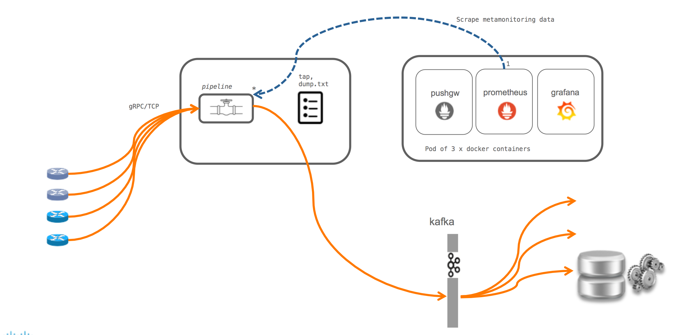
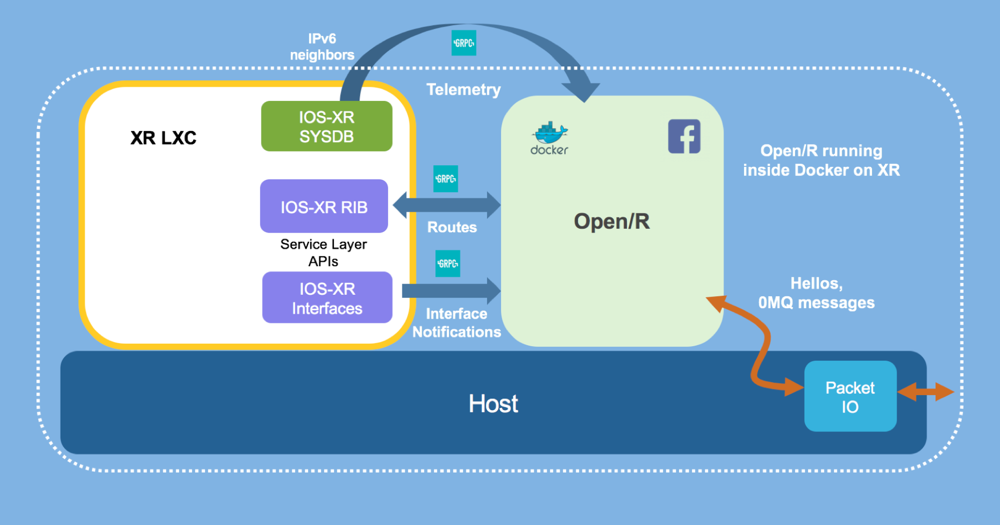

# Why Onbox Telemetry?

So we were able to successfully deploy telemetry collectors in an on-box fashion, running inside a container on the router.   
But, why do this?   

There is no one-size-fits-all technique for monitoring and managing network devices. There are a lot of network operators that will follow the typical approach: Set up the Model Driven Telemetry on IOS-XR and stream operational data to an external receiver or set of receivers. This is shown below. Pipeline as mentioned earlier, is used as a conduit to a set of tools like Kafka,prometheus etc.

However, quite a few developers have asked us if it’s possible to have a telemetry receiver run on the router inside a container (lxc or docker) so that applications running locally inside the container can take actions based on Telemetry data.

This may be done for different reasons:

Users may choose to simplify their server environment and not run external services (like
Kafka, influxDB stack or prometheus/Grafana etc.). Typically, some
background in devops engineering is often important to understand how to scale out these services and process large amounts of data coming from all routers at the same time.

The alerts or the remediation actions that a user intends to perform based on the Telemetry data received may be fairly simplistic and can be done on box.

Bear in mind that running onbox does come with its own concerns. Network devices typically have limited compute capacity (CPU/RAM) and limited disk capacity.  While CPU/RAM isolation can be achieved using Containers on box, managing the disk space on each individual router does require special care when dealing with Streaming Telemetry applications.
  
**If your telemetry receiver creates files, then make sure you perform log-rotation on the file when running the receiver on-box**.

Of course, there are examples where the Telemetry data streamed to the on-box receiver is utilized as a periodic update rather than onbox storage
which implies that each data push is regarded as a new snapshot of the state of the router being probed.

We did infact utilize this exact scenario when we pushed IPv6 Neighbor information from IOS-XR to Facebook's Open/R running on-box inside a container. Here, the telemetry collector/client code was integrated with Open/R. The basic setup is shown in the figure below:

with more details at the blog on xrdocs here:

>
><https://xrdocs.io/cisco-service-layer/blogs/2018-02-16-xr-s-journey-to-the-we-b-st-open-r-integration-with-ios-xr/>
