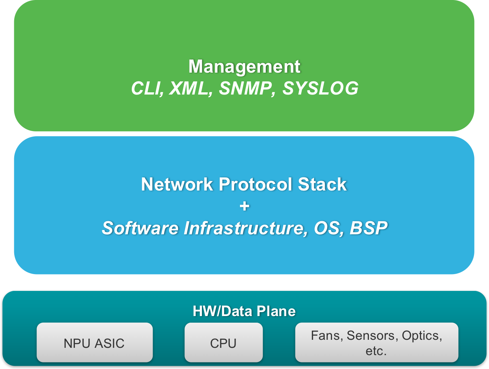
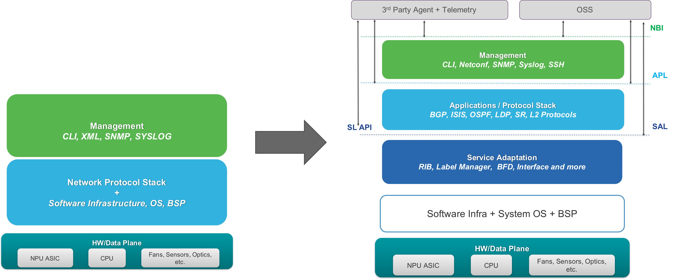
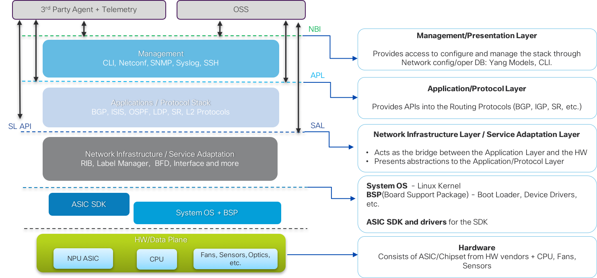

# Deconstructing the IOS-XR Network Stack

## Traditional IOS-XR Stack
When we typically visualize the IOS-XR network stack, we think about the constituent layers as something like the figure below:

Justifiably, for external users/operators, the network stack (NOS) appears to consist primarily of 2 layers:

* **Management/Manageability Layer**: This is the layer that exposes interaction points for the end user - CLI, XML RPCs, SNMP, Syslog, YANG models, Streaming Telemetry etc.
* **NOS internals**: This layer is considered to be a monolithic blob that encompasses the internals of the NOS including protocols, platform integration components and hardware abstraction layers to work with a particular platform and ASIC.

## The Evolution  

However, over the last few years, we have seen a significant shift in the way networks are operated by network engineers.The expectations on the APIs exposed by the internals of the NOS have evolved to serve use cases associated with custom protocol-stacks and controllers. Further, the contents of the NOS itself (set of protocols and features) have also come under scrutiny in the quest to run lean network stacks with just "the right amount of software" to reduce deployment cycles and prevent any issues arising within the stack from features and components not being utilized.

Consequently, the IOS-XR network stack has now evolved to expose several distinct layers to the end user (and more on the way):

  &nbsp;  
  &nbsp;  

## Breaking down the modern IOS-XR Stack:

The Modern IOS-XR Stack, as the evolution above suggests, is represented below with details on each layer:

  &nbsp;  

*  **Platform Integration Layer**: Typically consists of kernel and/or user-land drivers for devices such as fans, leds, sensors etc. The integration of these device specific drivers with the higher layers of the software stack happens at this layer. It this layer that allows a software stack to extract information (e.g. temperature) from sensors and influence component state (e.g. fan speed).

*  **Hardware Abstraction Layer**: This layer interacts with the ASIC SDK (provided by the ASIC vendor) and handles programming of the data plane based on RIB state, or LSD (label switch database) state etc.

*  **Network Infrastructure/Service Adaptation Layer**: Typically consists of components such as the RIB, Label Switch database, BFD, network interface handler and APIs for higher layers/agents.

*  **Network Application/Protocol Layer**: This layer contains protocols (BGP, ISIS, OSPF etc.) and features such as L2VPN, L3VPN etc.

*  **Manageability Layer**: This layer exposes command line interface (CLI) for features and protocols in the network application layer along with model-driven APIs for use with automation tools.

*  **Networking Hardware**: Consists of the ASIC that handles forwarding decisions and provides hooks (through the ASIC SDK) to help program route lookup tables in the hardware. The system components such as fans, sensors and optics make up the rest of this layer.

In this lab, we will focus primarily on the Network-Infrastructure layer or the "Service Adaptation Layer". This layer offers APIs for Controllers and third-party tools/agents that intend to interact directly with the network infrastructure layer components like RIB, LSD, BFD, interfaces etc., bypassing the IOS-XR internal database (SYSDB).

