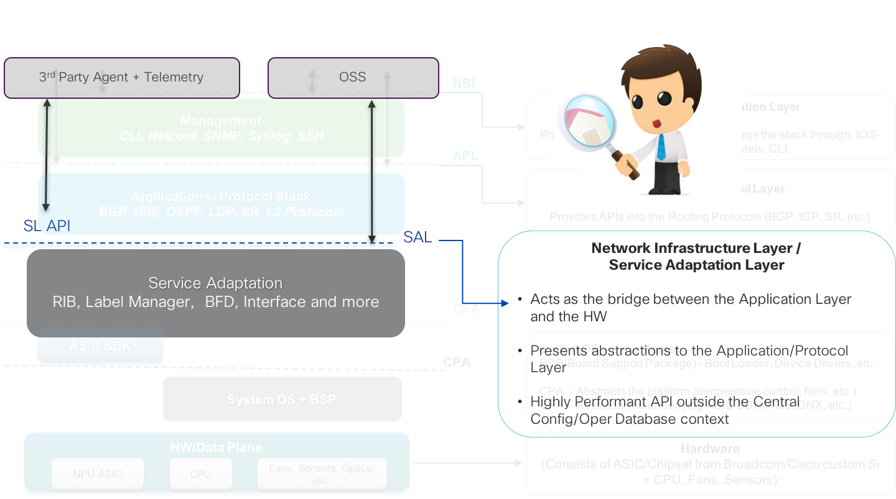
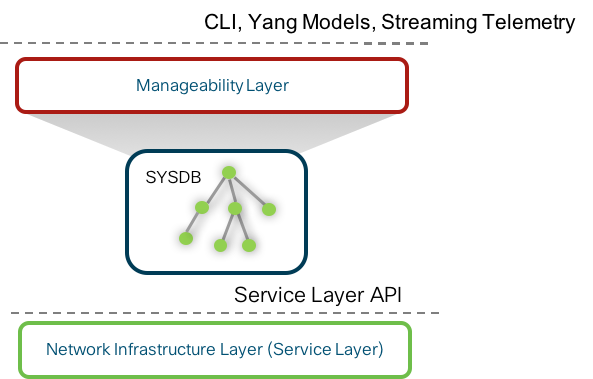

# Why do we need another API?

Let's focus on the Service Adaptation layer from the earlier breakdown of the stack:  

  &nbsp;  
  &nbsp;  

The API offered to the end-user by the Service Adaptation layer is called the Service-Layer API. This API is quite distinct from the Management/Manageability layer APIs (CLI, Yang Models, Telemetry) in the sense that these APIs are not tied to the IOS-XR internal database called SYSDB.
This is shown in the figure below. The Manageability Layer derives its capabilities from SYSDB - The CLI and the YANG models are essentially interaction points for SYSDB data models representing the configuration and operational state of IOS-XR features and capabilities.

&nbsp;  
&nbsp;  

&nbsp;  
&nbsp;  

The Service-Layer API, however, is distinct. It gives the end-user access directly to the Network Infrastructure Layer (Service-Adaptation Layer), completely bypassing SYSDB.

This leads to some inherent characteristics of the Service Layer API:

1. By not being tied to SYSDB, the Service-Layer APIs expose just the right amount of capabilities without being tied to the "feature knobs" supported by SYSDB. You get to control the state machine within the controller/agent/app that acts as a client to the Service-Layer API.

2. By providing an API directly into the Network Infrastructure layer, when a client interacts with the API the number of layers that the request and subsequent calls have to traverse is lower compared to Manageability Layer APIs. As a result, Service Layer APIs are able to afford a very level of performance. We will showcase this when we utilize the API to program routes into IOS-XR RIB.  

So, why do we need another API? A couple of customer(unnamed) quotes for your consumption:

> “The multiple layers in the stack get in the way – We need better performance!”

>“I have my own controller/protocol, just give me complete access to the infrastructure underneath”
