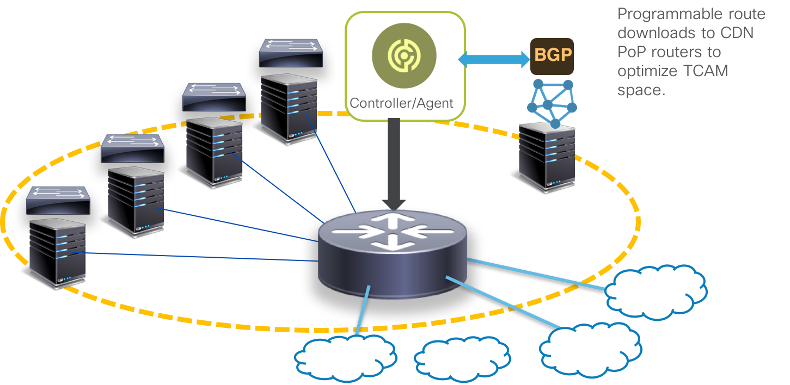

# Making the case for Service-Layer APIs

> *The use cases are evolving!*

The need for service-layer APIs can be illustrated through some representative use cases, described below.

## Programmable Route Downloads

The figure below illustrates a scenario seen often in CDN networks. Imagine a CDN PoP (Point of presence) network that usually involves servers and TOR switches combined with a few (or one) gateway router.
Owing to the small number of routers (usually expensive) within the network, the ratio of the cost of the routers to the cost of overall network in such CDN PoPs is pretty high. So in such scenarios, it makes sense to try and reduce the cost of the PoP by reducing the cost of the router. Usually, this is achieved  with fewer resources such as lower TCAM.

In such situations, it becomes essential to optimize the TCAM usage by programming select routes into the RIB before they get programmed into the HW TCAM. Further, this flexibility must be achieved without sacrificing performance.
In this case, **a performant API that allows a client to directly program the RIB becomes useful**.  

An OpemBMP controller to programmatically select BGP routes and program them into the global RIB can be found here: <https://github.com/akshshar/openbmp-controller>  

This example uses the IOS-XR Service Layer API's RIB vertical.  

  

## Traffic Engineering and Path Selection

Application-driven traffic engineering and path selection is usually accomplished through controllers that interact with Head-End based Segment-Routing policies or MPLS-TE configurations in response to changes in the network (interface events, network congestion, network-device failures etc.).
The policy that determines the traffic path can be completely subsumed into a controller that helps determine the exact label blocks and incoming label map (ILM) entries that must be programmed on each router along the path. The advantage of this technique is that it does not depend on any IGP or LDP protocol to distribute labels and does not require any particular "feature" running on the protocol stack.   

For this purpose, what we need is **an API that gives performant access to the Label Switch Database in the NOS, enables controllers to program label blocks and ILM entries based on an application's traffic state in the network**

  

## Distributed Agents/Protocol-Stacks

There are several use cases where network operators choose to run agents or protocol stacks as applications on routers instead of traditional NOS based protocols, in order to achieve more control on the capabilities and incremental features that the stock offers.  

These applications could simply be distributed agents that interact with the Label Switch database and create label forwarding entries in response to application requirements.  An example is Microsoft's SWAN agent/controller paradigm where a controller determines the label forwarding entries that must be programmed into individual routers while an on-box SWAN agent actually programs the label entries using the router's APIs  based on interactions with the controller. More details can be found here: <https://www.microsoft.com/en-us/research/uploads/prod/2013/08/Achieving-High-Utilization-with-Software-Driven-WAN.pdf>  

An example of how ILM entries can be programmed and removed using IOS-XR Service-Layer MPLS APIs using an onbox agent can be found here:  
<https://github.com/akshshar/ilm_rest_slapi/>  

Another example is Facebook's Open/R protocol that behaves like an IGP but runs as a third-party application on the router (and can coexist with other NOS protocols if needed). The advantage here is that the network operator gets complete control over the features, bugs and release lifecycles of the protocol stack by using an in-house stack (and now Open Source) like Open/R.  

To demonstrate how this works with IOS-XR, we integrated the platform layer of the Open/R stack with IOS-XR's Service-Layer RIB and Interface events API, enabling Open/R to run as an IGP inside a docker container while co-existing with IOS-XR's BGP stack.
More details on this integration can be found here:  

<https://xrdocs.io/cisco-service-layer/blogs/2018-02-16-xr-s-journey-to-the-we-b-st-open-r-integration-with-ios-xr/>

