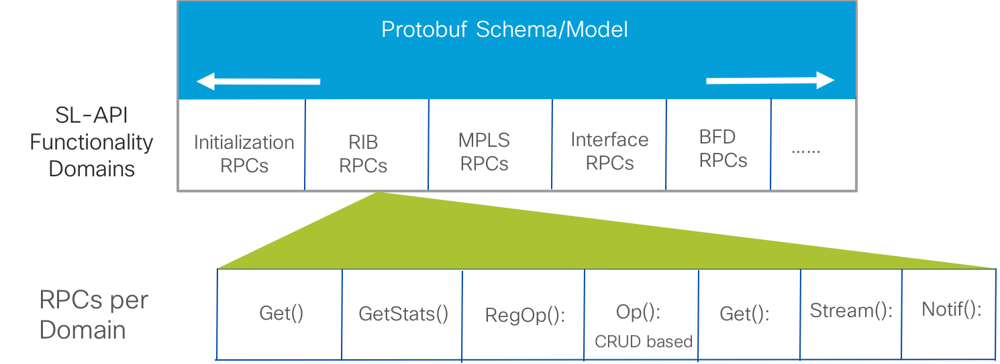

# Service-Layer API Architecture

## The Primary Tenets

The primary tenets behind the design and architecture of Service-Layer APIs in IOS-XR can be condensed to the following:  

* <u>**Model Driven**</u>:  Models act as versioned Contracts – easier to understand, document and version. Protobuf IDLs, or YANG can be used to model this API layer. **Currently, IOS-XR uses protobuf IDLs to model the API.**

&nbsp;  
&nbsp;  

* **Remote Procedure call (RPC) support**: Enables consistency in Application Development by ensuring that both on-box and off-box clients use the same technique to connect and use the service-layer API. gRPC, thrift are powerful RPC mechanisms suitable for the performance requirements at this layer. **IOS-XR uses gRPC as the RPC mechanism for Service-Layer APIs**.  

&nbsp;  
&nbsp;  

* **A Layered approach to APIs**: Clean separation of concerns between the infrastructure layer and management/Protocol layer. 
Crucial to have a singular focus for this layer – enabling Vendors such as Cisco to focus on just the right amount of software, with an exhaustive, complete API.  As discussed earlier, **the Service-Layer (or the Network Infrastucture layer) in IOS-XR is a distinct layer separate from the higher management and application/protocol layers.**  

&nbsp;  
&nbsp;  

## Architecture Overview

The figure below accurately shows the bird's eye view of the Service-Layer API architecture, consisting of the following components:

1. **Functionality Verticals/Domains**: These verticals define the broader capability categories supported by the API. In Version 1.0 of the Service-Layer API, the supported verticals are:  RIB, MPLS, Interface , and BFD. Each vertical supports data structures and RPCs defined in gpb. The initialization RPCs are mandatory RPCs used to connect a client to the gRPC server on the router and to send heartbeats and termination requests  from the server to the client.  

2. **Protobuf Schema/Model**:  Any potential modeling technique can be used to model the service-layer API. Currently GPB protobuf IDL is used to achieve this. These models (across the verticals) can be found on Github here: <https://github.com/Cisco-Service-Layer/service-layer-objmodel/tree/master/grpc/protos>    

  &nbsp;  
  &nbsp;  

  

  &nbsp;   
  &nbsp;  

3. **gRPC**: This is the current RPC mechanism in place. gRPC utilizes GPB protobuf IDL by default to convert the models into bindings in a variery of languages (c++, python, golang and more). These generated bindings can be used by the gRPC server (running on the router) and the gRPC client to serialize data and encode/decode the request/response exchanges between the server and the client.   

4. **Service-Layer gRPC clients** As shown in the figure above, the gRPC clients for service-layer can exist either as on-box (agents/protocol-stacks running natively or in containers) or exist off-box (within Controllers or  other open-source tools) to flexibly solve the use cases outlined in the previous section.

## Functionality Domains (Verticals) and RPCs  

As mentioned earlier, the Service Layer API consists of different functionality verticals/domains that define the categories of the capabilities that this API can offer. Each vertical then further consists of RPCs. This is shown below:

  &nbsp;  
  &nbsp;  

  

  &nbsp;  
  &nbsp;  

### Functionality domains (Verticals)

For the current version of Service-Layer API (version 1.0) on [Github](https://github.com/Cisco-Service-Layer/service-layer-objmodel), the supported verticals are:

1. **Initialization**: handles global initialization, sets up an event notification channel using GRPC streaming capabilities

2. **IPv4, IPv6 Route (RIB)**: Route manipulations (add, update, delete) for a certain VRF.

3. **MPLS**: handles allocation of label blocks and any incoming MPLS label mapping to a forwarding function.

4. **Interface**: Registered clients can subscribe to interface state event notifications.

5. **IPv4, IPv6 BFD**: Managing BFD sessions, and getting corresponding BFD session state notifications.

More functionalities will be added in the future.

### Template RPCs  

"Template" RPCs are the representative RPCs per functionality domain. Each domain will contain a corresponding RPC for the purposes outlined below:

|RPC    |Description|
|:--------|:---------|
|**(Vertical) Get()**|Used to query certain capabilities for that vertical|
|**(Vertical) GetStats()**|Used to query specific statistics for the vertical|
|**(Vertical) RegOp()**|Used to Register/Unregister/EoF, to notify the service layer server about interest in the vertical, no interest, and end of file (EoF), respectively. The EoF marker is useful for replay of objects in certain restart scenarios.|
|**(Vertical)(Object) Op()**|Used to add, delete, update objects.|
|**(Vertical)(Object) Get()**|Used to retrieve an object or a set of objects.|
|**Stream()** |GRPC “streaming” version of the non-streaming version of the function.|
|**Notif()**|A streaming notification function, e.g. asynchronous BFD session state events’ streaming.|
