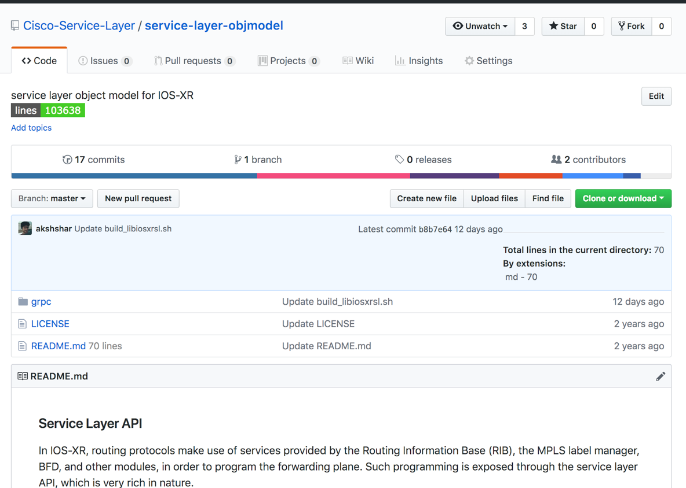
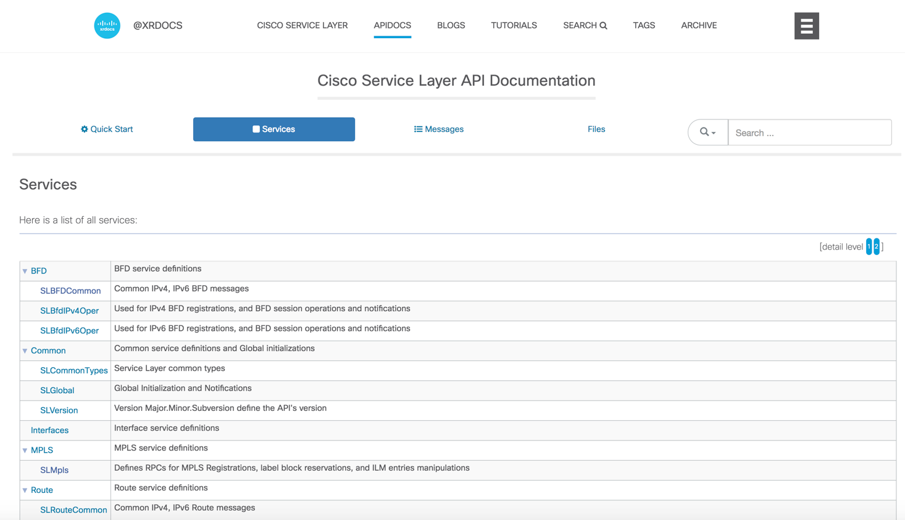

# I'm a Developer, Where and how do I start ?

### Github

Check out the Obj-model repository on Github at
><https://github.com/Cisco-Service-Layer/service-layer-objmodel>
>
<blockquote>

</blockquote>

This object model contains the following:

#### Proto definitions  

As described earlier, the API is model-driven and uses protobuf IDLs to represent the model. These proto definitions can be found here:  
><https://github.com/Cisco-Service-Layer/service-layer-objmodel/tree/master/grpc/protos>

#### Exhaustive  Unit Tests and tutorial apps
The Service-Layer API is always released with a set of unit tests that must pass before the API is released. These tests can be found here:

><https://github.com/Cisco-Service-Layer/service-layer-objmodel/tree/master/grpc/python/src/tests>   
>
>More details on running the tests using vagrant IOS-XR:
> ><https://xrdocs.io/cisco-service-layer/tutorials/2017-09-25-using-service-layer-apis-with-vagrant-iosxr/#run-the-python-unit-tests>
&nbsp;  
&nbsp;  

### XRdocs:  Blogs, Tutorials on Using Service Layer APIs and associated Libraries:

Great set of documentation, videos, blogs and tutorials associated with Service-Layer APIs can be found here: <https://xrdocs.io/cisco-service-layer/>
&nbsp;  
&nbsp;  

### APIdocs:  Doxygen based documentation, auto-generated from the proto files:

The APIdocs are auto-generated using doxygen on the proto files described above. The goal is to make sure API documentation is derived from and is therefore always in sync with the actual model that is published externally.These  docs can be generated using scripts in the github repository: <https://github.com/Cisco-Service-Layer/service-layer-objmodel/tree/master/grpc/docs/scripts>

>The generated docs are also hosted on xrdocs for easy traversal:
>
>https://xrdocs.io/cisco-service-layer/apidocs/>  
>
<blockquote>

</blockquote>
