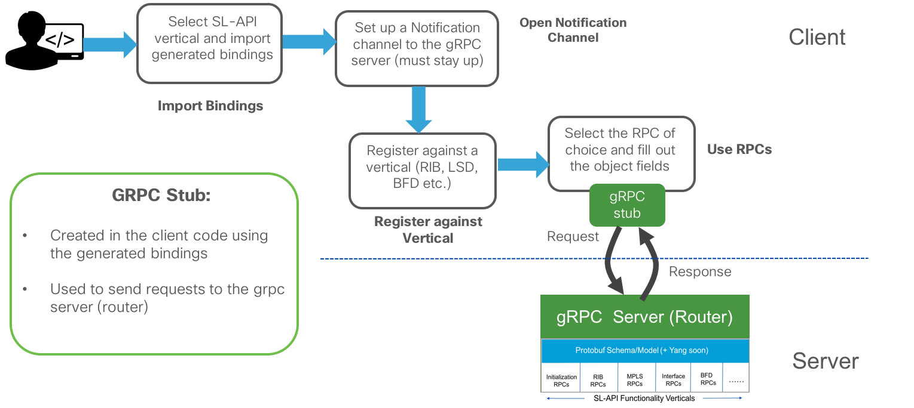

# The Workflow: Writing your first SL-API GRPC client

## Step 1: Understanding gRPC
Service-Layer APIs utilize gRPC as the RPC mechanism.
Before you begin, walk through https://grpc.io/ to get an overview of how grpc works

## Step 2: Clone the Object-Model repository for IOS-XR Service-Layer  

This repository contains the proto files (model), auto-generation scripts for documentation, client examples in python,c++ and golang along with unit-tests that have been run against the code before publishing.

```
Laptop-terminal:$ git clone https://github.com/Cisco-Service-Layer/service-layer-objmodel.git
Cloning into 'service-layer-objmodel'...
remote: Counting objects: 332, done.
remote: Total 332 (delta 0), reused 0 (delta 0), pack-reused 332
Receiving objects: 100% (332/332), 7.58 MiB | 8.03 MiB/s, done.
Resolving deltas: 100% (172/172), done.
Laptop-terminal:$ cd service-layer-objmodel/grpc/
Laptop-terminal:$ ls
cpp	docs	go	protos	python	utils	xrdocs

```  


## Step 2: Generate Bindings in a language of your choice

gRPC supports a wide variety of languages for binding generation. In this module (set of service-layer labs), we will focus on python, c++ and golang.  

Generate the bindings in your favorite  client language using the protobuf compiler: `protoc` (This can be downloaded from here: https://github.com/google/protobuf/releases or installed for your favorite distribution by installing `protobuf` using your distributions package installer):

Once you have protoc available, generate bindings in the language of your choice. For example, to obtain python bindings in general:

```shell
protoc --proto_path=src --python_out=genpy src/foo.proto src/bar/bar.proto
```
This creates bindings in a `genpy` folder.

For your convenience, we've already created binding generation scripts for python, c++ and golang in the respective folders:

### Python  
The directory structure under the python folder of the cloned object-model code is shown below.

```
Laptop-terminal:grpc $ pwd
/Users/akshshar/service-layer-objmodel/grpc
Laptop-terminal:grpc $
Laptop-terminal:grpc $ tree python
python
├── gen-bindings.sh
└── src
    ├── genpy
    │   ├── __init__.py
    │   ├── sl_bfd_common_pb2.py
    │   ├── sl_bfd_ipv4_pb2.py
    │   ├── sl_bfd_ipv6_pb2.py
    │   ├── sl_common_types_pb2.py
    │   ├── sl_global_pb2.py
    │   ├── sl_interface_pb2.py
    │   ├── sl_mpls_pb2.py
    │   ├── sl_route_common_pb2.py
    │   ├── sl_route_ipv4_pb2.py
    │   ├── sl_route_ipv6_pb2.py
    │   └── sl_version_pb2.py
    ├── lindt
    │   ├── __init__.py
    │   ├── exceptions.py
    │   ├── lindt.py
    │   └── serializers.py
    ├── tests
    │   ├── __init__.py
    │   ├── template.json
    │   ├── test_json.py
    │   ├── test_lindt.py
    │   └── test_serializer.py
    ├── tutorial
    │   ├── README.md
    │   ├── __init__.py
    │   ├── client_init.py
    │   ├── interface.py
    │   ├── mpls_ilm.py
    │   ├── quickstart.py
    │   └── vrf.py
    └── util
        ├── __init__.py
        └── util.py

6 directories, 31 files
Laptop-terminal:$

```

Notice `gen-bindings.sh`. It requires `protoc` to be installed on the system.
To clear out the pre-generated bindings (under `genpy`), just run:  

```
Laptop-terminal:$ cd service-layer-objmodel/grpc/
Laptop-terminal:grpc $ rm -f python/genpy
```
Now regenerate the bindings in the `genpy` folder by dropping into the `python` folder and running `gen-bindings.sh`:  

```
Laptop-terminal:grpc $ cd python/
Laptop-terminal:python $
Laptop-terminal:python $  ls
gen-bindings.sh	src
Laptop-terminal:python $  vi ./gen-bindings.sh
Laptop-terminal:python $  ./gen-bindings.sh
Generating Python bindings....
Done
Laptop-terminal:python $

```

Similarly, you will find `gen-bindings.sh` script in the `cpp` and the `golang` folders in the repository.  

<p style="margin: 2em 0 !important;padding: 1em;font-family: CiscoSans,Arial,Helvetica,sans-serif;font-size: 1em !important;text-indent: initial;background-color: #fdefef;border-radius: 5px;box-shadow: 0 1px 1px rgba(0,127,171,0.25);">**Important**: Generated bindings are tied to the version of gRPC that you're working with. Although there are pre-generated bindings in the repository - they are tied to gRPC release `0.13.1`. It is recommended to regenerate the bindings for the specific gRPC release you intend to run.</p>


## Step 3: Follow the workflow to write your client

Now that the base requirements are met, it is time to write the actual code. We will look at the actual code in subsequent labs, but in this lab let's capture a quick overview of what goes into the client code. The workflow is shown in the figure below:  

&nbsp;  
&nbsp;  

<p style="text-align: center;">
<a href="assets/images/writing-your-own-client.png"></a></p>

&nbsp;  
&nbsp;  

Writing a Service-Layer API client for a particular Functionality vertical:  

1. **Import Bindings**: Once the bindings for the language of your choice have been generated (as described in the previous section), import the bindings in your code (`import`, `#include` etc. depending on your language).

2. **Open Notification Channel**:  The first step is to utilize the initialization functionality vertical as described earlier to create a notification channel (typically running in a background thread to make sure it stays running as your code executes) to register the client to the gRPC server running on the router.  

3. **Register against Vertical**: Service-Layer APIs expect that any client trying to utilize an RPC within a given functionality vertical must register (using the registration RPC) for that vertical before making any further calls. Any calls without prior registration will be rejected.  

4.  **Use RPCs**: Once registered against a vertical, select the RPC of your choice (route add, label-block allocation, get-interface states etc.) and fill out the object fields in the gRPC stub before making a call to the gRPC server.


<p style="margin: 2em 0!important;padding: 1em;font-family: CiscoSans,Arial,Helvetica,sans-serif;font-size: 1em !important;text-indent: initial;background-color: #eff9ef;border-radius: 5px;box-shadow: 0 1px 1px rgba(0,127,171,0.25);">There you go, you now have a crash-course in the art of writing Service-Layer API clients for IOS-XR. Let's put this knowledge to use as we write clients in python, golang and c++ in the subsequent labs of this module!
</p>  
