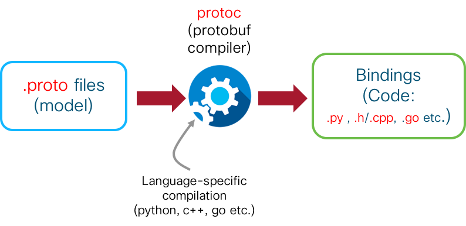

# Client Code: Install gRPC and regenerate bindings

We will develop and run the service-layer c++ clients on the `devbox`. The sl-api client will connect to the router over gRPC. So, the steps we intend to perform as part of this section are:

*  **Install the protoc compiler** Since we intend to build a c++ client, we must install `protoc` by building protobuf:3.5.0 package from github.  

*  Provide the model (.proto) files to the compiler and **generate bindings** (i.e. actual code in the form of .cc and .h files from the .proto files). This generated code is then used as a set of libraries to create our own client code.  

The process is depicted below:  




## Connect to the Devbox

Our next set of tasks will be performed on the devbox. Connection details are explained in the beginning of this lab. SSH into devbox:  

<p style="margin: 2em 0!important;padding: 1em;font-family: CiscoSans,Arial,Helvetica,sans-serif;font-size: 1em !important;text-indent: initial;background-color: #e6f2f7;border-radius: 5px;box-shadow: 0 1px 1px rgba(0,127,171,0.25);">**Username**: admin<br/>**Password**: admin<br/>**SSH port**: 2211
</p>  


```
Laptop-Terminal:$ ssh -p 2211 admin@10.10.20.170
admin@10.10.20.170's password:
Last login: Sun Aug 26 19:18:39 2018 from 192.168.122.1
admin@devbox:~$
admin@devbox:~$

```  


## Clone the Service-Layer Object Model Repository  

As described in the 1st lab of this module, titled: `Service-Layer APIs: Bring your own Protocol/Controller`, the Service-Layer API is model-driven and uses protobuf IDLs to represent the models. These proto definitions can be found here:    

><https://github.com/Cisco-Service-Layer/service-layer-objmodel/tree/master/grpc/protos>  

Clone this git repository onto the devbox. We will clone the release `v0.0.1`.

```
admin@devbox:~$ git clone https://github.com/Cisco-Service-Layer/service-layer-objmodel.git -b v0.0.1
Cloning into 'service-layer-objmodel'...
remote: Counting objects: 402, done.
remote: Compressing objects: 100% (45/45), done.
remote: Total 402 (delta 42), reused 44 (delta 25), pack-reused 332
Receiving objects: 100% (402/402), 7.60 MiB | 3.01 MiB/s, done.
Resolving deltas: 100% (214/214), done.
Checking connectivity... done.
admin@devbox:~$
```  

## View .proto files (models)  

Let's take a look at the `.proto` files that are packaged as part of the cloned repository:  


```
admin@devbox:service-layer-objmodel$ pwd
/home/admin/service-layer-objmodel
admin@devbox:service-layer-objmodel$ cd grpc/protos/
admin@devbox:protos$ ls -l
total 116
-rw-rw-r-- 1 admin admin  4810 Aug 27 04:40 sl_bfd_common.proto
-rw-rw-r-- 1 admin admin  6918 Aug 27 04:40 sl_bfd_ipv4.proto
-rw-rw-r-- 1 admin admin  6916 Aug 27 04:40 sl_bfd_ipv6.proto
-rw-rw-r-- 1 admin admin 23285 Aug 27 04:40 sl_common_types.proto
-rw-rw-r-- 1 admin admin  6150 Aug 27 04:40 sl_global.proto
-rw-rw-r-- 1 admin admin  8068 Aug 27 04:40 sl_interface.proto
-rw-rw-r-- 1 admin admin 17521 Aug 27 04:40 sl_mpls.proto
-rw-rw-r-- 1 admin admin  9912 Aug 27 04:40 sl_route_common.proto
-rw-rw-r-- 1 admin admin  7203 Aug 27 04:40 sl_route_ipv4.proto
-rw-rw-r-- 1 admin admin  7165 Aug 27 04:40 sl_route_ipv6.proto
-rw-rw-r-- 1 admin admin   713 Aug 27 04:40 sl_version.proto
admin@devbox:protos$ ls
```

Briefly, these protobuf models cover the following capabilities:  


|Functionality Vertical|Proto File|Supported RPCs|
|:---------------------|:---------|:-------------|
|Common across Verticals|`sl_common_types.proto`|<br/>Defines common data structures for all verticals, such as Error codes, Operation codes (registration, notification etc.), and structures for XR interfaces and ip-addresses.<br/><br/>|
|Common across Verticals|`sl_version.proto`|<br/>Contains an enum specifying the current Version of SL-API. <br/>Current Version=`v0.0.1`<br/><br/>|
|Initialization|`sl_global.proto`|<br/>RPCs to fetch global information related to different functionality verticals and global limits and to create and mantain an initialization channel with IOS-XR service-layer over gRPC<br/><br/>|
|Interface|`sl_interface.proto`|<br/>RPCs and data structures(messages) to get global and specific interface states, to enable/disable event notifications for specific interfaces and to register for interface state events<br/><br/> |
|MPLS|`sl_mpls.proto`|<br/>RPCs to register against the MPLS vertical, allocate or delete label blocks and manipulate ILM (incoming Label Map) to forwarding function entries. It also defines all the data structures used by the MPLS vertical's RPCs<br/><br/>|
|Route|`sl_route_common.proto`|<br/>Defines data structures (messages) that are used by the Route vertical's RPCs. These data structures include Registration objects (to register against the route vertical for a given VRF), VRF objects, and common Router and Path objects utilized by both IPv4 and IPv6 Route proto files.<br/><br/>  |
|Route|`sl_route_ipv4.proto`|<br/>Defines the RPC calls for IPv4 route changes (adding, deleting and getting IPv4 routes) and VRF registration - essential before one can manipulate routes in the IOS-XR RIB.<br/><br/>|
|Route|`sl_route_ipv6.proto`|<br/>Defines the RPC calls for IPv6 route changes (adding, deleting and getting IPv6 routes) and VRF registration - essential before one can manipulate routes in the IOS-XR RIB.<br/><br/>|
|BFD|`sl_bfd_common.proto`|<br/>Defines data structures (messages) that are used by the BFD vertical's RPCs. These data structures include Registration objects (to register against the BFD vertical), State Objects (to identify a BFD event), Get objects and Set(Tx Interval Manipulation) Objects.<br/><br/>|
|BFD |`sl_bfd_ipv4.proto`|<br/>Defines the RPCs for adding, deleting, updating, and retrieving BFD sessions: used for IPv4 BFD registrations, and BFD session operations and notifications.<br/><br/>|
|BFD|`sl_bfd_ipv6.proto`|<br/>Defines the RPCs for adding, deleting, updating, and retrieving BFD sessions: used for IPv6 BFD registrations, and BFD session operations and notifications.<br/><br/>|


## Build c++ bindings from proto files

To generate the c++ bindings from existing .proto files, we need the `protoc` compiler available on the `devbox`.
For c++, the protobuf compiler (protoc) needs to be built from scratch. We choose a fairly recent version==`3.5.0` to be compatible with the gRPC version=`1.7.0` that we will build and install subsequently.

<p style="margin: 2em 0!important;padding: 1em;font-family: CiscoSans,Arial,Helvetica,sans-serif;font-size: 1em !important;text-indent: initial;background-color: #e6f2f7;border-radius: 5px;box-shadow: 0 1px 1px rgba(0,127,171,0.25);">The gRPC version that must be used for the client code is closely tied to the gRPC version used by the server code present in a given IOS-XR release.  

**In the IOS-XR Programmability sandbox, the routers are running IOS-XR release 6.4.1 which utilizes the gRPC version=`1.7.0`.  
Hence `grpcio` version selected for this lab will have version=`1.7.0`**
</p>    


### Install the Build tools and Generate bindings

The installation of the build dependencies (protoc, grpc) is already automated using scripts as part of the cloned git repo.

Hop into the directory `grpc/cpp` under the cloned `service-layer-objmodel` repo directory:

```
admin@devbox:~$ cd service-layer-objmodel/
admin@devbox:service-layer-objmodel$ pwd
/home/admin/service-layer-objmodel
admin@devbox:service-layer-objmodel$ cd grpc/cpp/
admin@devbox:cpp$ ls
build_libiosxrsl.sh  build_tutorials.sh  clean.sh  gen-bindings.sh  src
admin@devbox:cpp$
```

Dumping the contents of the script `build_libiosxrsl.sh`:  


```bash
admin@devbox:cpp$ cat build_libiosxrsl.sh
#!/bin/bash

usage="
$(basename "$0") [-h] [-g/--grpc-version -p/--protobuf-version -v/--verbose] -- script to install desired versions of grpc, protobuf and build the libiosxrsl.a library
where:
    -h  show this help text
    -g/--grpc-version specify the grpc version to be installed (mandatory argument)
    -p/--protobuf-version specify the protobuf version to be installed (mandatory argument)
    -v  get more verbose information during script execution
"

while true; do
  case "$1" in
    -v | --verbose )     VERBOSE=true; shift ;;
    -h | --help )        echo "$usage"; exit 0 ;;
    -g | --grpc-version )   GRPC_VERSION=$2; shift; shift;;
    -p | --protobuf-version ) PROTOBUF_VERSION=$2; shift; shift;;
    -- ) shift; break ;;
    * ) break ;;
  esac
done

if ! [[ $GRPC_VERSION ]] || ! [[ $PROTOBUF_VERSION ]]; then
   echo "Must specify both  -g/--grpc--version and -p/--protobuf-version, see usage below"
   echo "$usage"
   exit 0
fi

if [[ $VERBOSE ]];then
    set -x
fi

# Install pkg-config first
apt-get update && apt-get install -y \
         autoconf automake libtool curl make g++ unzip git pkg-config

PROTOBUF_INSTALLED_VERSION=`pkg-config --exists protobuf && pkg-config --modversion protobuf`
GRPC_INSTALLED_VERSION=`pkg-config --exists grpc && pkg-config --modversion grpc++`


SCRIPT_DIR="$(cd "$(dirname "${0}")"; echo "$(pwd)")"


if [[ $GRPC_INSTALLED_VERSION != $GRPC_VERSION ]] ||
        [[ $PROTOBUF_INSTALLED_VERSION != $PROTOBUF_VERSION ]]; then

    rm -rf ~/tempdir
    mkdir -p ~/tempdir/protobuf

    if [[ $PROTOBUF_INSTALLED_VERSION != $PROTOBUF_VERSION ]]; then
        #install protobuf
        cd ~/tempdir/protobuf
        curl -OL https://github.com/protocolbuffers/protobuf/releases/download/v${PROTOBUF_VERSION}/protobuf-all-${PROTOBUF_VERSION}.tar.gz && \
        tar -zxvf protobuf-all-${PROTOBUF_VERSION}.tar.gz && \
        ./configure && \
        make && \
        make install &&\
        ldconfig

    fi

    if [[ $GRPC_INSTALLED_VERSION != $GRPC_VERSION ]]; then
        #install grpc
        git clone https://github.com/grpc/grpc.git -b v${GRPC_VERSION} ~/tempdir/grpc && \
        cd ~/tempdir/grpc && \
        git submodule update --init && \
        make && \
        make install
    fi
fi

cd ~/ && rm -rf ~/tempdir

# Clean up first
$SCRIPT_DIR/clean.sh

# Create the c++ bindings from proto files
cd $SCRIPT_DIR
./gen-bindings.sh

# Drop into the src directory to build and install the service layer bindings as a static library libiosxrsl.a
cd $SCRIPT_DIR/src
mkdir -p /usr/local/lib/iosxrsl

if [ ! -f /usr/local/lib/libiosxrsl.a ]; then
    # Create the genobj directory
    mkdir -p genobj
    make
    make install
    ldconfig
fi
admin@devbox:cpp$


```

Breaking down the script, we can see that this script accepts the version of gRPC (`1.7.0` for the current sandbox with IOS-XR release=`6.4.1`) and protobuf(`3.5.0` compatible with gRPC=`1.7.0`) as inputs from the user.  

```bash
#!/bin/bash

usage="
$(basename "$0") [-h] [-g/--grpc-version -p/--protobuf-version -v/--verbose] -- script to install desired versions of grpc, protobuf and build the libiosxrsl.a library
where:
    -h  show this help text
    -g/--grpc-version specify the grpc version to be installed (mandatory argument)
    -p/--protobuf-version specify the protobuf version to be installed (mandatory argument)
    -v  get more verbose information during script execution
"

while true; do
  case "$1" in
    -v | --verbose )     VERBOSE=true; shift ;;
    -h | --help )        echo "$usage"; exit 0 ;;
    -g | --grpc-version )   GRPC_VERSION=$2; shift; shift;;
    -p | --protobuf-version ) PROTOBUF_VERSION=$2; shift; shift;;
    -- ) shift; break ;;
    * ) break ;;
  esac
done

if ! [[ $GRPC_VERSION ]] || ! [[ $PROTOBUF_VERSION ]]; then
   echo "Must specify both  -g/--grpc--version and -p/--protobuf-version, see usage below"
   echo "$usage"
   exit 0
fi

if [[ $VERBOSE ]];then
    set -x
fi

```

Install the necessary dependencies for a debian environment (tested for Ubuntu:16.04) and then proceeds to fetch and build the user specified versions of protobuf and grpc:

```bash

# Install pkg-config first
apt-get update && apt-get install -y \
         autoconf automake libtool curl make g++ unzip git pkg-config

PROTOBUF_INSTALLED_VERSION=`pkg-config --exists protobuf && pkg-config --modversion protobuf`
GRPC_INSTALLED_VERSION=`pkg-config --exists grpc && pkg-config --modversion grpc++`


SCRIPT_DIR="$(cd "$(dirname "${0}")"; echo "$(pwd)")"


if [[ $GRPC_INSTALLED_VERSION != $GRPC_VERSION ]] ||
        [[ $PROTOBUF_INSTALLED_VERSION != $PROTOBUF_VERSION ]]; then

    rm -rf ~/tempdir
    mkdir -p ~/tempdir/protobuf

    if [[ $PROTOBUF_INSTALLED_VERSION != $PROTOBUF_VERSION ]]; then
        #install protobuf
        cd ~/tempdir/protobuf
        curl -OL https://github.com/protocolbuffers/protobuf/releases/download/v${PROTOBUF_VERSION}/protobuf-all-${PROTOBUF_VERSION}.tar.gz && \
        tar -zxvf protobuf-all-${PROTOBUF_VERSION}.tar.gz && \
        ./configure && \
        make && \
        make install &&\
        ldconfig

    fi

    if [[ $GRPC_INSTALLED_VERSION != $GRPC_VERSION ]]; then
        #install grpc
        git clone https://github.com/grpc/grpc.git -b v${GRPC_VERSION} ~/tempdir/grpc && \
        cd ~/tempdir/grpc && \
        git submodule update --init && \
        make && \
        make install
    fi
fi

cd ~/ && rm -rf ~/tempdir


```


Once these dependencies are installed, it proceeds to generate c++ bindings using the `gen-bindings.sh` script:

```
# Clean up first
$SCRIPT_DIR/clean.sh

# Create the c++ bindings from proto files
cd $SCRIPT_DIR
./gen-bindings.sh

```

<div style="margin: 2em 0 !important;padding: 1em;font-family: CiscoSans,Arial,Helvetica,sans-serif;font-size: 1em !important;text-indent: initial;background-color: #e6f2f7;border-radius: 5px;box-shadow: 0 1px 1px rgba(0,127,171,0.25);">
Taking a quick look at the `gen-bindings.sh` script; it uses the `protoc` compiler to compile the proto files and generate .cc and .h files in the `grpc/cpp/src/gencpp` directory of the git repo.

<p><pre><code>
admin@devbox:cpp$ cat gen-bindings.sh
#!/bin/bash
#
# Copyright (c) 2016 by cisco Systems, Inc.
# All rights reserved.
#
mkdir -p src/gencpp
printf "Generating cplusplus bindings..."
protoc -I ../protos --grpc_out=./src/gencpp --plugin=protoc-gen-grpc=`which grpc_cpp_plugin` ../protos/*.proto
protoc -I ../protos --cpp_out=./src/gencpp ../protos/*.proto
echo "Done"
admin@devbox:cpp$
</code></pre></p>
</div>

Once the bindings have been built, the `build_libiosxrsl.sh` script continues and combines the generated .cpp and .h files into a single `libiosxrsl.a` static library that will be used by out c++ client we will write later.

```
# Drop into the src directory to build and install the service layer bindings as a static library libiosxrsl.a
cd $SCRIPT_DIR/src
mkdir -p /usr/local/lib/iosxrsl

if [ ! -f /usr/local/lib/libiosxrsl.a ]; then
    # Create the genobj directory
    mkdir -p genobj
    make
    make install
    ldconfig
fi
```

To see the script in action, run it as `sudo` to enable installation of the dependencies and of the resultant `libiosxrsl.a` library in the required locations on the `devbox` and specify the versions of grpc and protobuf:  


<p style="margin: 2em 0 !important;padding: 1em;font-family: CiscoSans,Arial,Helvetica,sans-serif;font-size: 1em !important;text-indent: initial;background-color: #e6f2f7;border-radius: 5px;box-shadow: 0 1px 1px rgba(0,127,171,0.25);">
**sudo password for devbox**: `admin`
</p>  


<p><pre><code>
admin@devbox:cpp$ <mark>sudo ./build_libiosxrsl.sh -g 1.7.0 -p 3.5.0</mark>
[sudo] password for admin:
Hit:1 http://ppa.launchpad.net/ansible/ansible/ubuntu xenial InRelease
Get:2 http://security.ubuntu.com/ubuntu xenial-security InRelease [107 kB]   
Hit:3 http://us.archive.ubuntu.com/ubuntu xenial InRelease                                                         
Get:4 https://download.docker.com/linux/ubuntu xenial InRelease [66.2 kB]
Get:5 http://us.archive.ubuntu.com/ubuntu xenial-updates InRelease [109 kB]
Get:6 http://us.archive.ubuntu.com/ubuntu xenial-backports InRelease [107 kB]


.........................# OUTPUT SNIPPED #.............................


 gencpp/sl_mpls.grpc.pb.cc gencpp/sl_bfd_common.pb.cc gencpp/sl_bfd_ipv6.grpc.pb.cc gencpp/sl_mpls.pb.cc gencpp/sl_bfd_ipv6.pb.cc gencpp/sl_interface.grpc.pb.cc gencpp/sl_version.grpc.pb.cc gencpp/sl_interface.pb.cc gencpp/sl_interface.pb.h gencpp/sl_bfd_ipv4.pb.h gencpp/sl_version.pb.h gencpp/sl_route_ipv6.grpc.pb.h gencpp/sl_route_common.grpc.pb.h gencpp/sl_common_types.grpc.pb.h gencpp/sl_route_ipv6.pb.h gencpp/sl_global.grpc.pb.h gencpp/sl_common_types.pb.h gencpp/sl_route_ipv4.grpc.pb.h gencpp/sl_global.pb.h gencpp/sl_route_ipv4.pb.h gencpp/sl_bfd_common.grpc.pb.h gencpp/sl_mpls.grpc.pb.h gencpp/sl_bfd_common.pb.h gencpp/sl_bfd_ipv6.grpc.pb.h gencpp/sl_mpls.pb.h gencpp/sl_bfd_ipv6.pb.h gencpp/sl_route_common.pb.h gencpp/sl_interface.grpc.pb.h


.........................# OUTPUT SNIPPED #.............................


genobj/sl_route_common.grpc.pb.o gencpp/sl_route_common.grpc.pb.cc
g++ -g -std=c++11 -I/usr/local/include -pthread -c -o genobj/sl_bfd_common.grpc.pb.o gencpp/sl_bfd_common.grpc.pb.cc
g++ -g -std=c++11 -I/usr/local/include -pthread -c -o genobj/sl_mpls.grpc.pb.o gencpp/sl_mpls.grpc.pb.cc
g++ -g -std=c++11 -I/usr/local/include -pthread -c -o genobj/sl_bfd_common.pb.o gencpp/sl_bfd_common.pb.cc
g++ -g -std=c++11 -I/usr/local/include -pthread -c -o genobj/sl_bfd_ipv6.grpc.pb.o gencpp/sl_bfd_ipv6.grpc.pb.cc
g++ -g -std=c++11 -I/usr/local/include -pthread -c -o genobj/sl_mpls.pb.o gencpp/sl_mpls.pb.cc
g++ -g -std=c++11 -I/usr/local/include -pthread -c -o genobj/sl_bfd_ipv6.pb.o gencpp/sl_bfd_ipv6.pb.cc
g++ -g -std=c++11 -I/usr/local/include -pthread -c -o genobj/sl_interface.grpc.pb.o gencpp/sl_interface.grpc.pb.cc
g++ -g -std=c++11 -I/usr/local/include -pthread -c -o genobj/sl_version.grpc.pb.o gencpp/sl_version.grpc.pb.cc
g++ -g -std=c++11 -I/usr/local/include -pthread -c -o genobj/sl_interface.pb.o gencpp/sl_interface.pb.cc
ar rcv libiosxrsl.a  genobj/sl_route_common.pb.o


.........................# OUTPUT SNIPPED #.............................


a - genobj/sl_mpls.grpc.pb.o
a - genobj/sl_bfd_common.pb.o
a - genobj/sl_bfd_ipv6.grpc.pb.o
a - genobj/sl_mpls.pb.o
a - genobj/sl_bfd_ipv6.pb.o
a - genobj/sl_interface.grpc.pb.o
a - genobj/sl_version.grpc.pb.o
a - genobj/sl_interface.pb.o
ranlib libiosxrsl.a
mkdir -p /usr/local/lib/
mkdir -p /usr/local/include/iosxrsl
cp -p libiosxrsl.a  /usr/local/lib/
cp -p gencpp/sl_interface.pb.h gencpp/sl_bfd_ipv4.pb.h gencpp/sl_version.pb.h gencpp/sl_route_ipv6.grpc.pb.h gencpp/sl_route_common.grpc.pb.h gencpp/sl_common_types.grpc.pb.h gencpp/sl_route_ipv6.pb.h gencpp/sl_global.grpc.pb.h gencpp/sl_common_types.pb.h gencpp/sl_route_ipv4.grpc.pb.h gencpp/sl_global.pb.h gencpp/sl_route_ipv4.pb.h gencpp/sl_bfd_common.grpc.pb.h gencpp/sl_mpls.grpc.pb.h gencpp/sl_bfd_common.pb.h gencpp/sl_bfd_ipv6.grpc.pb.h gencpp/sl_mpls.pb.h gencpp/sl_bfd_ipv6.pb.h gencpp/sl_route_common.pb.h gencpp/sl_interface.grpc.pb.h gencpp/sl_bfd_ipv4.grpc.pb.h gencpp/sl_version.grpc.pb.h /usr/local/include/iosxrsl
admin@devbox:cpp$
</code></pre></p>


At the end of the process, the following bindings will be generated in the `grpc/cpp/src/gencpp` directory:  


```
admin@devbox:gencpp$
admin@devbox:gencpp$ pwd
/home/admin/service-layer-objmodel/grpc/cpp/src/gencpp
admin@devbox:gencpp$
admin@devbox:gencpp$ ls -l
total 2696
-rw-r--r-- 1 root root    639 Sep  9 04:11 sl_bfd_common.grpc.pb.cc
-rw-r--r-- 1 root root   1449 Sep  9 04:11 sl_bfd_common.grpc.pb.h
-rw-r--r-- 1 root root 105091 Sep  9 04:11 sl_bfd_common.pb.cc
-rw-r--r-- 1 root root  59734 Sep  9 04:11 sl_bfd_common.pb.h
-rw-r--r-- 1 root root  12075 Sep  9 04:11 sl_bfd_ipv4.grpc.pb.cc
-rw-r--r-- 1 root root  43955 Sep  9 04:11 sl_bfd_ipv4.grpc.pb.h
-rw-r--r-- 1 root root 143870 Sep  9 04:11 sl_bfd_ipv4.pb.cc
-rw-r--r-- 1 root root  84671 Sep  9 04:11 sl_bfd_ipv4.pb.h
-rw-r--r-- 1 root root  12075 Sep  9 04:11 sl_bfd_ipv6.grpc.pb.cc
-rw-r--r-- 1 root root  43955 Sep  9 04:11 sl_bfd_ipv6.grpc.pb.h
-rw-r--r-- 1 root root 144689 Sep  9 04:11 sl_bfd_ipv6.pb.cc
-rw-r--r-- 1 root root  88921 Sep  9 04:11 sl_bfd_ipv6.pb.h
-rw-r--r-- 1 root root    645 Sep  9 04:11 sl_common_types.grpc.pb.cc
-rw-r--r-- 1 root root   1355 Sep  9 04:11 sl_common_types.grpc.pb.h
-rw-r--r-- 1 root root  67270 Sep  9 04:11 sl_common_types.pb.cc
-rw-r--r-- 1 root root  61504 Sep  9 04:11 sl_common_types.pb.h
-rw-r--r-- 1 root root   4721 Sep  9 04:11 sl_global.grpc.pb.cc
-rw-r--r-- 1 root root  17362 Sep  9 04:11 sl_global.grpc.pb.h
-rw-r--r-- 1 root root  81631 Sep  9 04:11 sl_global.pb.cc
-rw-r--r-- 1 root root  43016 Sep  9 04:11 sl_global.pb.h
-rw-r--r-- 1 root root  13372 Sep  9 04:11 sl_interface.grpc.pb.cc
-rw-r--r-- 1 root root  46793 Sep  9 04:11 sl_interface.grpc.pb.h
-rw-r--r-- 1 root root 172815 Sep  9 04:11 sl_interface.pb.cc
-rw-r--r-- 1 root root  94207 Sep  9 04:11 sl_interface.pb.h
-rw-r--r-- 1 root root  17801 Sep  9 04:11 sl_mpls.grpc.pb.cc
-rw-r--r-- 1 root root  62334 Sep  9 04:11 sl_mpls.grpc.pb.h
-rw-r--r-- 1 root root 269460 Sep  9 04:11 sl_mpls.pb.cc
-rw-r--r-- 1 root root 151052 Sep  9 04:11 sl_mpls.pb.h
-rw-r--r-- 1 root root    645 Sep  9 04:11 sl_route_common.grpc.pb.cc
-rw-r--r-- 1 root root   1482 Sep  9 04:11 sl_route_common.grpc.pb.h
-rw-r--r-- 1 root root 200036 Sep  9 04:11 sl_route_common.pb.cc
-rw-r--r-- 1 root root 112777 Sep  9 04:11 sl_route_common.pb.h
-rw-r--r-- 1 root root  18397 Sep  9 04:11 sl_route_ipv4.grpc.pb.cc
-rw-r--r-- 1 root root  62660 Sep  9 04:11 sl_route_ipv4.grpc.pb.h
-rw-r--r-- 1 root root 102739 Sep  9 04:11 sl_route_ipv4.pb.cc
-rw-r--r-- 1 root root  60854 Sep  9 04:11 sl_route_ipv4.pb.h
-rw-r--r-- 1 root root  18397 Sep  9 04:11 sl_route_ipv6.grpc.pb.cc
-rw-r--r-- 1 root root  62660 Sep  9 04:11 sl_route_ipv6.grpc.pb.h
-rw-r--r-- 1 root root 103818 Sep  9 04:11 sl_route_ipv6.pb.cc
-rw-r--r-- 1 root root  67091 Sep  9 04:11 sl_route_ipv6.pb.h
-rw-r--r-- 1 root root    630 Sep  9 04:11 sl_version.grpc.pb.cc
-rw-r--r-- 1 root root   1200 Sep  9 04:11 sl_version.grpc.pb.h
-rw-r--r-- 1 root root   3209 Sep  9 04:11 sl_version.pb.cc
-rw-r--r-- 1 root root   3720 Sep  9 04:11 sl_version.pb.h
admin@devbox:gencpp$

```

Further, the corresponding object files are in the directory `grpc/cpp/src/genobj`:


```
admin@devbox:genobj$ pwd
/home/admin/service-layer-objmodel/grpc/cpp/src/genobj
admin@devbox:genobj$
admin@devbox:genobj$ ls -l
total 30816
-rw-r--r-- 1 root root  384720 Sep  9 04:12 sl_bfd_common.grpc.pb.o
-rw-r--r-- 1 root root  835336 Sep  9 04:12 sl_bfd_common.pb.o
-rw-r--r-- 1 root root 2321560 Sep  9 04:12 sl_bfd_ipv4.grpc.pb.o
-rw-r--r-- 1 root root 1162272 Sep  9 04:12 sl_bfd_ipv4.pb.o
-rw-r--r-- 1 root root 2321560 Sep  9 04:12 sl_bfd_ipv6.grpc.pb.o
-rw-r--r-- 1 root root 1168384 Sep  9 04:12 sl_bfd_ipv6.pb.o
-rw-r--r-- 1 root root  377912 Sep  9 04:12 sl_common_types.grpc.pb.o
-rw-r--r-- 1 root root  696768 Sep  9 04:12 sl_common_types.pb.o
-rw-r--r-- 1 root root 1595184 Sep  9 04:12 sl_global.grpc.pb.o
-rw-r--r-- 1 root root  739000 Sep  9 04:12 sl_global.pb.o
-rw-r--r-- 1 root root 2365800 Sep  9 04:12 sl_interface.grpc.pb.o
-rw-r--r-- 1 root root 1214560 Sep  9 04:12 sl_interface.pb.o
-rw-r--r-- 1 root root 3366128 Sep  9 04:12 sl_mpls.grpc.pb.o
-rw-r--r-- 1 root root 1736992 Sep  9 04:12 sl_mpls.pb.o
-rw-r--r-- 1 root root  381128 Sep  9 04:12 sl_route_common.grpc.pb.o
-rw-r--r-- 1 root root 1414160 Sep  9 04:11 sl_route_common.pb.o
-rw-r--r-- 1 root root 3375832 Sep  9 04:12 sl_route_ipv4.grpc.pb.o
-rw-r--r-- 1 root root  980208 Sep  9 04:12 sl_route_ipv4.pb.o
-rw-r--r-- 1 root root 3375832 Sep  9 04:11 sl_route_ipv6.grpc.pb.o
-rw-r--r-- 1 root root  988048 Sep  9 04:12 sl_route_ipv6.pb.o
-rw-r--r-- 1 root root  360296 Sep  9 04:12 sl_version.grpc.pb.o
-rw-r--r-- 1 root root  348104 Sep  9 04:12 sl_version.pb.o
admin@devbox:genobj$

```

These object files are then combined into the static library: `libiosxrsl.a` and it gets installed in the conventional location: `/usr/local/lib`, along with the `grpc` and `protobuf` libraries.

Checking the installed grpc libraries:

```
admin@devbox:genobj$ ls  -l /usr/local/lib/libgrpc*
-rwxr-xr-x 1 root root 2578912 Sep  3 18:21 /usr/local/lib/libgrpc.a
-rwxr-xr-x 1 root root 1226616 Sep  3 18:21 /usr/local/lib/libgrpc++.a
-rwxr-xr-x 1 root root 2231938 Sep  3 18:21 /usr/local/lib/libgrpc_cronet.a
-rwxr-xr-x 1 root root 2758912 Sep  3 18:21 /usr/local/lib/libgrpc++_cronet.a
lrwxrwxrwx 1 root root      23 Sep  3 18:21 /usr/local/lib/libgrpc_cronet.so -> libgrpc_cronet.so.5.0.0
lrwxrwxrwx 1 root root      25 Sep  3 18:21 /usr/local/lib/libgrpc++_cronet.so -> libgrpc++_cronet.so.1.7.0
lrwxrwxrwx 1 root root      21 Sep  3 18:21 /usr/local/lib/libgrpc++_cronet.so.1 -> libgrpc++_cronet.so.5
-rwxr-xr-x 1 root root 1075664 Sep  3 18:21 /usr/local/lib/libgrpc++_cronet.so.1.7.0
lrwxrwxrwx 1 root root      23 Sep  3 18:21 /usr/local/lib/libgrpc_cronet.so.5 -> libgrpc_cronet.so.5.0.0
lrwxrwxrwx 1 root root      25 Sep  3 18:21 /usr/local/lib/libgrpc++_cronet.so.5 -> libgrpc++_cronet.so.1.7.0
-rwxr-xr-x 1 root root  957992 Sep  3 18:21 /usr/local/lib/libgrpc_cronet.so.5.0.0
-rwxr-xr-x 1 root root  344440 Sep  3 18:21 /usr/local/lib/libgrpc++_error_details.a
lrwxrwxrwx 1 root root      32 Sep  3 18:21 /usr/local/lib/libgrpc++_error_details.so -> libgrpc++_error_details.so.1.7.0
lrwxrwxrwx 1 root root      28 Sep  3 18:21 /usr/local/lib/libgrpc++_error_details.so.1 -> libgrpc++_error_details.so.5
-rwxr-xr-x 1 root root   35432 Sep  3 18:21 /usr/local/lib/libgrpc++_error_details.so.1.7.0
lrwxrwxrwx 1 root root      32 Sep  3 18:21 /usr/local/lib/libgrpc++_error_details.so.5 -> libgrpc++_error_details.so.1.7.0
-rwxr-xr-x 1 root root  514720 Sep  3 18:21 /usr/local/lib/libgrpc++_reflection.a
lrwxrwxrwx 1 root root      29 Sep  3 18:21 /usr/local/lib/libgrpc++_reflection.so -> libgrpc++_reflection.so.1.7.0
lrwxrwxrwx 1 root root      25 Sep  3 18:21 /usr/local/lib/libgrpc++_reflection.so.1 -> libgrpc++_reflection.so.5
-rwxr-xr-x 1 root root  237184 Sep  3 18:21 /usr/local/lib/libgrpc++_reflection.so.1.7.0
lrwxrwxrwx 1 root root      29 Sep  3 18:21 /usr/local/lib/libgrpc++_reflection.so.5 -> libgrpc++_reflection.so.1.7.0
lrwxrwxrwx 1 root root      16 Sep  3 18:21 /usr/local/lib/libgrpc.so -> libgrpc.so.5.0.0
lrwxrwxrwx 1 root root      18 Sep  3 18:21 /usr/local/lib/libgrpc++.so -> libgrpc++.so.1.7.0
lrwxrwxrwx 1 root root      14 Sep  3 18:21 /usr/local/lib/libgrpc++.so.1 -> libgrpc++.so.5
-rwxr-xr-x 1 root root  344848 Sep  3 18:21 /usr/local/lib/libgrpc++.so.1.7.0
lrwxrwxrwx 1 root root      16 Sep  3 18:21 /usr/local/lib/libgrpc.so.5 -> libgrpc.so.5.0.0
lrwxrwxrwx 1 root root      18 Sep  3 18:21 /usr/local/lib/libgrpc++.so.5 -> libgrpc++.so.1.7.0
-rwxr-xr-x 1 root root 1151920 Sep  3 18:21 /usr/local/lib/libgrpc.so.5.0.0
-rwxr-xr-x 1 root root 2244556 Sep  3 18:21 /usr/local/lib/libgrpc_unsecure.a
-rwxr-xr-x 1 root root 1084898 Sep  3 18:21 /usr/local/lib/libgrpc++_unsecure.a
lrwxrwxrwx 1 root root      25 Sep  3 18:21 /usr/local/lib/libgrpc_unsecure.so -> libgrpc_unsecure.so.5.0.0
lrwxrwxrwx 1 root root      27 Sep  3 18:21 /usr/local/lib/libgrpc++_unsecure.so -> libgrpc++_unsecure.so.1.7.0
lrwxrwxrwx 1 root root      23 Sep  3 18:21 /usr/local/lib/libgrpc++_unsecure.so.1 -> libgrpc++_unsecure.so.5
-rwxr-xr-x 1 root root  295288 Sep  3 18:21 /usr/local/lib/libgrpc++_unsecure.so.1.7.0
lrwxrwxrwx 1 root root      25 Sep  3 18:21 /usr/local/lib/libgrpc_unsecure.so.5 -> libgrpc_unsecure.so.5.0.0
lrwxrwxrwx 1 root root      27 Sep  3 18:21 /usr/local/lib/libgrpc++_unsecure.so.5 -> libgrpc++_unsecure.so.1.7.0
-rwxr-xr-x 1 root root  997840 Sep  3 18:21 /usr/local/lib/libgrpc_unsecure.so.5.0.0
admin@devbox:genobj$

```
and the protobuf library:

```
admin@devbox:genobj$ ls  -l /usr/local/libproto*
ls: cannot access '/usr/local/libproto*': No such file or directory
admin@devbox:genobj$ ls  -l /usr/local/lib/libproto*
-rw-r--r-- 1 root root  71115692 Sep  3 18:16 /usr/local/lib/libprotobuf.a
-rwxr-xr-x 1 root root       996 Sep  3 18:16 /usr/local/lib/libprotobuf.la
-rw-r--r-- 1 root root   8618058 Sep  3 18:16 /usr/local/lib/libprotobuf-lite.a
-rwxr-xr-x 1 root root      1031 Sep  3 18:16 /usr/local/lib/libprotobuf-lite.la
lrwxrwxrwx 1 root root        26 Sep  3 18:16 /usr/local/lib/libprotobuf-lite.so -> libprotobuf-lite.so.15.0.0
lrwxrwxrwx 1 root root        26 Sep  3 18:16 /usr/local/lib/libprotobuf-lite.so.15 -> libprotobuf-lite.so.15.0.0
-rwxr-xr-x 1 root root   3458816 Sep  3 18:16 /usr/local/lib/libprotobuf-lite.so.15.0.0
lrwxrwxrwx 1 root root        21 Sep  3 18:16 /usr/local/lib/libprotobuf.so -> libprotobuf.so.15.0.0
lrwxrwxrwx 1 root root        21 Sep  3 18:16 /usr/local/lib/libprotobuf.so.15 -> libprotobuf.so.15.0.0
-rwxr-xr-x 1 root root  27772608 Sep  3 18:16 /usr/local/lib/libprotobuf.so.15.0.0
-rw-r--r-- 1 root root 104925918 Sep  3 18:16 /usr/local/lib/libprotoc.a
-rwxr-xr-x 1 root root      1012 Sep  3 18:16 /usr/local/lib/libprotoc.la
lrwxrwxrwx 1 root root        19 Sep  3 18:16 /usr/local/lib/libprotoc.so -> libprotoc.so.15.0.0
lrwxrwxrwx 1 root root        19 Sep  3 18:16 /usr/local/lib/libprotoc.so.15 -> libprotoc.so.15.0.0
-rwxr-xr-x 1 root root  34287088 Sep  3 18:16 /usr/local/lib/libprotoc.so.15.0.0
admin@devbox:genobj$


```

### Verify Installed gRPC version

```
admin@devbox:cpp$ pkg-config --modversion grpc++
1.7.0
admin@devbox:cpp$

```

### Verify Installed Protobuf versions

```
admin@devbox:cpp$ pkg-config --modversion protobuf
3.5.0
admin@devbox:cpp$

```


#### User-Created iosxrsl Library (contains the generated bindings)  

```
admin@devbox:genobj$ ls -l /usr/local/lib/libiosxrsl.a
-rw-r--r-- 1 root root 33438592 Sep  9 04:12 /usr/local/lib/libiosxrsl.a
admin@devbox:genobj$

```

#### User-Created iosxrsl header Files

```
admin@devbox:genobj$ ls -l /usr/local/include/iosxrsl/
total 1188
-rw-r--r-- 1 root root   1449 Sep  9 04:11 sl_bfd_common.grpc.pb.h
-rw-r--r-- 1 root root  59734 Sep  9 04:11 sl_bfd_common.pb.h
-rw-r--r-- 1 root root  43955 Sep  9 04:11 sl_bfd_ipv4.grpc.pb.h
-rw-r--r-- 1 root root  84671 Sep  9 04:11 sl_bfd_ipv4.pb.h
-rw-r--r-- 1 root root  43955 Sep  9 04:11 sl_bfd_ipv6.grpc.pb.h
-rw-r--r-- 1 root root  88921 Sep  9 04:11 sl_bfd_ipv6.pb.h
-rw-r--r-- 1 root root   1355 Sep  9 04:11 sl_common_types.grpc.pb.h
-rw-r--r-- 1 root root  61504 Sep  9 04:11 sl_common_types.pb.h
-rw-r--r-- 1 root root  17362 Sep  9 04:11 sl_global.grpc.pb.h
-rw-r--r-- 1 root root  43016 Sep  9 04:11 sl_global.pb.h
-rw-r--r-- 1 root root  46793 Sep  9 04:11 sl_interface.grpc.pb.h
-rw-r--r-- 1 root root  94207 Sep  9 04:11 sl_interface.pb.h
-rw-r--r-- 1 root root  62334 Sep  9 04:11 sl_mpls.grpc.pb.h
-rw-r--r-- 1 root root 151052 Sep  9 04:11 sl_mpls.pb.h
-rw-r--r-- 1 root root   1482 Sep  9 04:11 sl_route_common.grpc.pb.h
-rw-r--r-- 1 root root 112777 Sep  9 04:11 sl_route_common.pb.h
-rw-r--r-- 1 root root  62660 Sep  9 04:11 sl_route_ipv4.grpc.pb.h
-rw-r--r-- 1 root root  60854 Sep  9 04:11 sl_route_ipv4.pb.h
-rw-r--r-- 1 root root  62660 Sep  9 04:11 sl_route_ipv6.grpc.pb.h
-rw-r--r-- 1 root root  67091 Sep  9 04:11 sl_route_ipv6.pb.h
-rw-r--r-- 1 root root   1200 Sep  9 04:11 sl_version.grpc.pb.h
-rw-r--r-- 1 root root   3720 Sep  9 04:11 sl_version.pb.h
admin@devbox:genobj$


```

The `libiosxrsl.a` library will be used during the linker phase of the build process for our c++ client while the header files above will be utilized during the compilation phase. Together these files constitute the `bindings` generated from the .proto files and provide the RPCs to work with the required functionality vertical of the Service Layer API.


<p style="margin: 2em 0!important;padding: 1em;font-family: CiscoSans,Arial,Helvetica,sans-serif;font-size: 1em !important;text-indent: initial;background-color: #eff9ef;border-radius: 5px;box-shadow: 0 1px 1px rgba(0,127,171,0.25);"> Perfect! We are now ready to start running existing tutorials and analyze how to write our own.</p>
