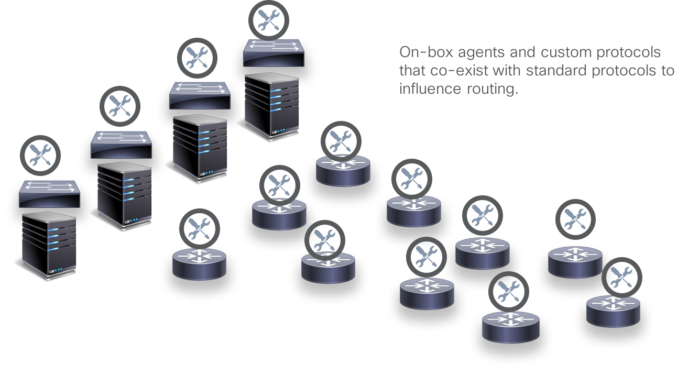
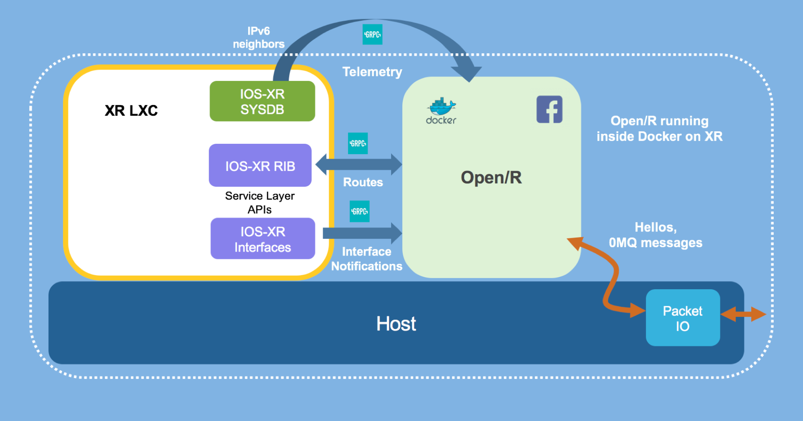

# Real World use cases

## Distributed Agents/Protocol-Stacks

There are several use cases where network operators choose to run agents or protocol stacks as applications on routers instead of traditional NOS based protocols, in order to achieve more control on the capabilities and incremental features that the stock offers.  

These applications could simply be distributed agents that interact with the Label Switch database and create label forwarding entries in response to application requirements.  An example is Microsoft's SWAN agent/controller paradigm where a controller determines the label forwarding entries that must be programmed into individual routers while an on-box SWAN agent actually programs the label entries using the router's APIs  based on interactions with the controller. More details can be found here: <https://www.microsoft.com/en-us/research/uploads/prod/2013/08/Achieving-High-Utilization-with-Software-Driven-WAN.pdf>  

>An example of how ILM entries can be programmed and removed using IOS-XR >Service-Layer MPLS APIs using an onbox agent can be found here:  
><https://github.com/akshshar/ilm_rest_slapi/>  

Another example is Facebook's Open/R protocol that behaves like an IGP and runs like a third-party application on the router (and can coexist with other NOS protocols if needed). The advantage here is that the network operator gets complete control over the features, bugs and release lifecycles of the protocol stack by using an in-house stack (and now Open Source) like Open/R.  

To demonstrate how this works with IOS-XR, we integrated the platform layer of the Open/R stack with IOS-XR's Service-Layer RIB and Interface events API, enabling Open/R to run as an IGP inside a docker container while co-existing with IOS-XR's BGP stack.

>More details on this integration can be found here:  
>
><https://xrdocs.io/cisco-service-layer/blogs/2018-02-16-xr-s-journey-to-the-we-b-st-open-r-integration-with-ios-xr/>

Thus, we ran the Open/R + Service-layer integration code as an application inside a docker container much like our sample run in the previous section. The basic set up is demonstrated below:

